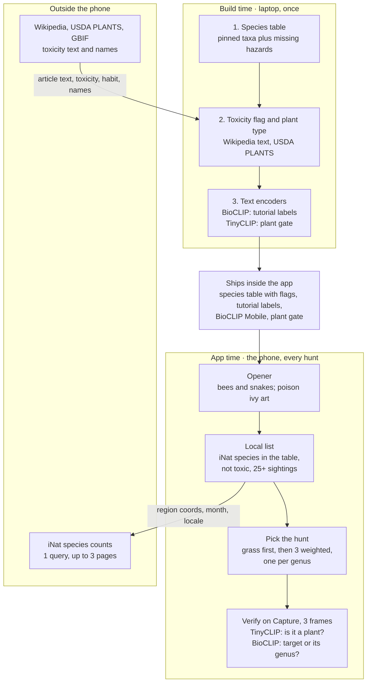

# wild-find — v1 PRD

Oct 5, 2026 · @Ashley

## Summary

wild-find sends kids 8 and up outside to find and photograph plants common where they are; open-weight models on the phone check each photo, and no photo ever leaves the device.

|  |  |
| --- | --- |
| Platform | Native Android, Kotlin; two test phones: Samsung Galaxy S24 Ultra and Google Pixel 9 |
| Models | TinyCLIP ViT-8M gates plant vs not-plant and BioCLIP 2.5 Mobile checks the plant, both on the phone at each capture; no language model |
| Network | One iNaturalist query per hunt, requiring at most three paginated HTTP requests, sent with coarse region coordinates |
| Region | Any whole-degree region with enough iNaturalist sightings; built and tested in the West Georgia region, key 34\_-85: a 75 km radius around (34, -85) that covers Carrollton |
| Content | Plant species seen near the kid in the current calendar month, named by their iNaturalist common name |
| Hunt | First-ever hunt: grass tutorial, then 3 targets; every later hunt: 3 targets |
| Safety | Look. Photograph. Leave it where it grows. |
| Deadline | Internal ship deadline: October 11, 2026, 11:59 PM PDT |

## Redesign, Oct 7

The first design built a fixed West Georgia menu at build time: Gemma brainstormed kid words, a chain of gates turned them into taxa, Gemma wrote a fact card for each from Wikipedia, and Claude fact-checked every card. On Oct 7 the brainstorm returned only 10 words with greedy decoding and 29 across 10 seeds, about half of them generic or garden crops, and every new region would have needed the whole chain plus a hand review. That doesn't scale past one region.

Now each model does only what data can't, and everything else is a lookup:

- **Which plants:** the live iNaturalist pull for wherever the kid is, filtered on the phone against BioCLIP Mobile's own 4,271-species table, since a plant outside it can't be verified anyway
- **What to call it:** the iNaturalist common name in the device language
- **Is it toxic:** one flag per species-table row, built once from Wikipedia text and USDA PLANTS; no model, because TinyCLIP, its bigger siblings, and the full BioCLIP all scored toxicity near chance (AUC 0.42 to 0.65)
- **Is it this plant:** BioCLIP, passing at the genus, so a kid's wrong oak still counts
- **What to look for:** the target's common name and its type (tree, vine, fern…) show from the start; there are no hints

Gemma no longer runs at build time, and fact cards and the Claude fact-check are gone. Every probe behind this is in `docs/results/day-2/`.

Later on Oct 7, Gemma left the app too. Its scene hints in two outdoor runs all said some version of "look for a big tree near the woods edge," and asked to describe the 20 most-seen local targets from their scientific names, E2B got 4 right and 7 wrong enough to mislead (the sycamore's peeling bark, the sweetgum's star-shaped leaves). The pass that decides a find (row 4 below) needs no language model, so the app ships without one: no 2.6 GB download, no hint button. The same day, continuous verify ran 366 ms a frame and got the phone hot, so verify moved to a Capture button.

## Problem and Audience

Kids get sent outside with no goal, so the screen wins; wild-find gives them something local to find and keeps the phone to a short clue.

- **Who:** kids 8 and up, playing on a parent or guardian's Android phone
- **Evidence:** firsthand, the three grown boys in my house
- **Prior art:** Seek by iNaturalist offers kid-safe, on-device ID with monthly challenges ([iNat](https://help.inaturalist.org/en/support/solutions/articles/151000169914-what-is-the-difference-between-inaturalist-and-seek-by-inaturalist-)); other kid nature-hunt apps exist, and the post names them once verified
- **Differentiator:** wild-find gives the child something local to find, named the way people around them name it, with all photo understanding done by open-weight models on the phone
- **Not claimed:** wild-find is not the first nature scavenger-hunt app

## Goals and Non-Goals

v1 succeeds when a kid finishes a real hunt outside and the verifier stays honest on photos it never trained its thresholds on.

**Goals**

- **Screen stays short:** a 3-target hunt takes under 20 minutes, with under 1 minute of screen time per target
- **Correct passes:** 90% or more of right-group holdout photos pass
- **No free passes:** 5% or fewer of wrong-group, non-plant, and screen holdout photos pass, and 5% or fewer of wide shots pass in the live field test
- **Works offline:** a cached hunt completes in airplane mode

**Non-goals for v1**

| Out of scope | Why |
| --- | --- |
| Medium and High difficulty | Needs the tiebreaker shot; v2 |
| Tiebreaker shot | v2 |
| Licensed reference photos | v3; category illustrations until then |
| Animals and bugs as targets | Kids chase them on screen and walk up to things that bite |
| Fungi as targets | BioCLIP Mobile was trained on plants only and can't verify them; a v2 candidate |
| Teaching look-alikes | Look-alikes simply pass at Low |
| Accounts, leaderboards, streaks, sharing, uploads, long-term progression | COPPA collection for no gameplay gain |
| iOS | No test device |
| A bundled offline list | One can't exist for every region; a region plays offline only after one online pull |
| DigitalOcean category | Models stay on the phone |
| React | Animation-first native UI |

## Decisions

Every call below is settled; open items live in Open Questions.

| Area | Decision |
| --- | --- |
| Audience | Kids 8 and up; no taxonomy jargon in the UI |
| Platform | Native Android in Kotlin; two test phones, Samsung Galaxy S24 Ultra and Google Pixel 9; no iOS; no Vestige code |
| Repo | wild-find; new repo started inside the challenge window; MIT license |
| Runtime models | Open-weight only, all running on the phone |
| Model roles | TinyCLIP ViT-8M (MIT) gates plant vs not-plant on the reticle crop; BioCLIP 2.5 Mobile checks the target and hazards on it; full BioCLIP 2.5 makes the tutorial label vectors at build time; no model judges toxicity; no language model ships (Gemma 4 E2B was tested and dropped Oct 7); Pl@ntNet rejected |
| Safety model | Look, photograph, leave it where it grows. Hazard recognition is an extra warning, never a safety guarantee; the app never tells a child a plant is safe |
| Difficulty | Selector exists; v1 ships Low only |
| Region | Any whole-degree region; a region needs one online iNaturalist pull before it plays offline, since no bundled list can cover every region; tested in the West Georgia region, key 34\_-85 |
| Targets | Species from the live iNaturalist pull that are in BioCLIP Mobile's species table, aren't toxic-flagged or hazards, and have a common name of 3 words or fewer in the device language; species with no common name there are skipped; at most one target per genus in a hunt |
| Local filter | A species is eligible with 25+ research-grade sightings in the region for the current calendar month, across all available years |
| Plant type | Shown with the target: USDA PLANTS growth habit (tree, shrub, vine, herb, grass) where it has one, else fern, moss, grass, or conifer from taxonomy, else none |
| Hunt shape | First-ever hunt: grass tutorial, then 3 targets; later hunts: 3 targets; targets picked by sighting-weighted random |
| Look-alikes | A find passes when the target, or another species in its genus, outscores the hunt's other locally eligible species on the reticle crop, so look-alikes inside the genus pass; never taught in v1 |
| Framing | Live camera with a center reticle and a Capture button; verify runs only on a capture; a far subject still passes, and "Get closer or zoom in" shows only when a capture misses and the focused distance in diopters times the zoom ratio is under 2.0; pinch zoom allowed; no capture verdict without a focused reading |
| Scoring | One star per find; one leave-it star when the plant is clearly still rooted |
| Hints | None. The target's common name and type show from the start of each hunt |
| Toxicity flag | Built once on the laptop for every species-table row. A species is flagged when its English Wikipedia article has a sentence with the whole word toxic, toxin, or poison (other plants' names such as poison ivy removed first), when USDA PLANTS rates it moderate or severe, or when it has no article or one under 1,500 characters. Names match through GBIF. Best effort, like hazard detection, never a safety claim; on Oct 7 it flagged 30 of 117 West Georgia species and wrongly dropped about 6 |
| Location | Android coarse location only, rounded to whole degrees; the device is in a region only when its rounded key equals that region's key; the query always sends the region center, never device coordinates; manual region pick supported |
| Images | Category illustrations in v1; licensed photos in v3 |
| UI | Animation-first; Jetpack Compose hosts camera and chrome and plays sprite sheets for the opener and Briar, the mascot; no Rive, no React |
| Distribution | GitHub Release APK with BioCLIP Mobile and the TinyCLIP plant gate inside; nothing downloads after install; outdoor demo video |
| Credits | README and About screen credit BioCLIP 2.5 Mobile, BioCLIP 2.5, TinyCLIP, OpenCLIP, iNaturalist, Wikipedia, USDA PLANTS, and GBIF |
| Prize categories | Best Use of Gemma, entered with the measured case for shipping without it; DigitalOcean dropped |
| Later versions | Tiebreaker shot in v2; licensed photos in v3 |

## User Stories

The kid hunts and leaves every plant where it grows; the parent sets the boundaries. The build queue lives in [stories.md](stories.md).

**Kid**

- As a kid, I want 3 local things to find so that going outside has a goal
- As a kid, I want an easy first win so that I learn how the game works
- As a kid, I want to learn the leave-it rule before I start so that I know to look, not touch
- As a kid, I want to know what kind of plant I'm looking for so that I know where to start
- As a kid, I want to know fast if my photo counts so that I get back to looking
- As a kid, I want a finish screen with my stars so that the hunt feels done

**Parent or guardian**

- As a parent, I want no account, no uploads, and coarse location only so that I don't hand over my kid's data
- As a parent, I want the app to never call a plant safe so that my kid leaves every plant alone
- As a parent who denies location, I want a manual region pick so that the app still runs

**Edge cases**

- As a kid with no signal, I want my hunt to work from the cache so that the woods don't end the game
- As a kid somewhere with too few sightings, I want a clear message so that I'm not handed an empty list
- As a kid whose capture misses from far away, I want "Get closer or zoom in" so that I know what to fix
- As a kid who photographs a likely hazard plant, I want a warning so that I give it extra space

## Functional Requirements

Eight P0s ship the hunt; one P1 follows; four P2s shape the design now. Requirement IDs stay fixed; R6 and R9 were dropped with Gemma on Oct 7.

### P0: Must ship

| ID | Requirement | Acceptance criteria |
| --- | --- | --- |
| R1 | Safety opener | First launch shows bees and snakes, with poison ivy drawn into the art; one rule: "Look. Photograph. Leave it where it grows."; no copy says safe, harmless, not poisonous, or okay to touch; replayable from the menu |
| R2 | Hunt list | One iNaturalist query per hunt, requiring at most three paginated HTTP requests: coarse region coordinates, current calendar month across all available years, plants, research grade, device locale for common names; a species is eligible with 25+ sightings, a species-table row, no toxic or hazard flag, and a common name of 3 words or fewer; fewer than 3 eligible widens the radius to 150 km once; cached under the versioned cache key; location denied falls back to a manual region pick; still fewer than 3 shows the coverage message |
| R3 | Grass tutorial | The first-ever hunt opens with grass, followed by 3 normal targets; a grass close-up passes when TinyCLIP calls the reticle crop a plant and grass is in BioCLIP's top 3 of the fixed tutorial label set, the 11 labels Day 1 measured (Poaceae, Quercus, Polypodiopsida, Trifolium, Pinus, Taraxacum, and the 5 hazard species), never the hunt's full label universe (49 of 52 CC0 grass photos passed both on Day 1; BioCLIP top 3 alone passed 50 and top-1 alone 45; the one lawn the gate rejected scored a plant share of 0.39); the plant gate's labels include grass; the hazard check doesn't run during the tutorial, because 9 of 54 grass photos warned against the menu labels on Day 1 (1 of 54 against the species table), and the leave-it rule stays on screen; done in under 60 seconds; never repeats once completed |
| R4 | Target pick | 3 targets per hunt by sighting-weighted random from eligible species, never two from one genus; a hazard or toxic-flagged species is never a target |
| R5 | Verify | Follows the Runtime Logic verify table on each Capture tap; a find needs the target (or its genus) to outscore the hunt's other locally eligible species on the reticle crop for 3 frames in a row; a hazard match shows a warning and gives no star; no result is ever presented as evidence of safety |
| R7 | Privacy | Android coarse location permission only; no fine location requested; coordinates rounded again before the query; no photo or precise location leaves the device; no account; no analytics |
| R8 | Offline | Both models ship in the APK; a cached hunt completes in airplane mode; a region never pulled online can't start a hunt offline and says it needs signal once |
| R15 | Hunt complete | The last target passes, a short success animation plays, the stars show, then Hunt Again or Home; only the current hunt's state persists |

### P1: Fast follow

| ID | Requirement | Acceptance criteria |
| --- | --- | --- |
| R10 | Leave-it star | One star per valid find; a second star when the photo clearly shows the plant still rooted; a held, picked, or cut plant gets no leave-it star; copy encourages leaving plants growing without sounding punitive; the model never judges whether touching was safe |

### P2: Design for, don't build

| ID | Requirement | Design constraint now |
| --- | --- | --- |
| R11 | Medium and High difficulty | Grouping level is a config value, not code |
| R12 | Tiebreaker shot | Verify accepts more than one capture per target |
| R13 | Licensed reference photos (v3) | A target's image slot exists now and can take an attributed photo later |
| R14 | iOS | Game logic stays out of Android-only code |

## Non-Functional Requirements

Day-1 and Day-2 measurements on the test phone are in hole 4 and `docs/results/day-2.md`.

| Area | Target | Verified by |
| --- | --- | --- |
| Privacy | No photo or precise location leaves the device; gameplay requests carry only coarse region coordinates plus ordinary request metadata such as IP address | Network log on the test phone |
| Offline | A full hunt runs in airplane mode from the cache | Field test |
| Verify latency | One capture's 3 frames take about 0.6 s on the S24 Ultra (189 ms a frame at p50, Oct 7); between captures the models are idle | Gate harness (S05) |
| Download size | Nothing after install; the APK carries BioCLIP (46,986,589 bytes), the plant gate (about 33 MB), and the species table (about 17.5 MB) | Build |
| Memory | About 3 GB PSS was Gemma; without it the app holds the two ONNX models and the species table; RAM recorded by the harness | Gate harness (S05) |
| Heat and battery | A 20-minute capture-mode session stays below moderate thermal status; continuous verify reached severe in 36 minutes on Oct 7 | Gate harness (S05) |
| Sunlight | High-contrast, large type that reads in direct sun | Field test |
| Accessibility | 48 dp touch targets; content descriptions; no color-only signals | Accessibility Scanner |
| Reading level | All kid-facing text at an age-8 level | Review |
| iNat etiquette | One query per hunt, requiring at most three paginated HTTP requests, plus one widened query only when fewer than 3 words are eligible; a User-Agent that names the app | Code review |

## Architecture

Build time runs once on the laptop and ships its files in the app; at app time no photo or precise location leaves the phone, and gameplay requests carry only coarse region coordinates plus ordinary request metadata.



The core loop runs on each capture: TinyCLIP rejects non-plants, and BioCLIP checks the target against the other local species on the reticle crop.

## Build Pipeline

Runs once on the laptop in Python with uv. Gemma never runs here.

1. **Species table:** the pinned BioCLIP taxa files plus a row for each hazard species they lack, with hazard flags (species_table.npy, species_labels.json)
2. **Toxicity flag:** `make toxicity` reads each species-table row's English Wikipedia article (redirects followed, 50 per request, reference sections and citations stripped) and USDA PLANTS' toxicity ratings, widened to every GBIF synonym of each moderate or severe species; flags per the Decisions rule; commits `pipeline/data/toxicity.json` with each flag's evidence and article revision, since CI doesn't fetch articles; `make assets` merges the flag and genus into species_labels.json. The Oct 7 build flagged 2,161 of 4,272 rows: 1,369 stubs (mostly rare species with short English articles), 685 toxicity sentences, 87 with no article, 20 from USDA alone (`docs/results/day-2/toxicity-build-4.log`); "non-toxic", "not toxic", and their "poisonous" forms never count as a claim
3. **Plant type:** USDA PLANTS' growth habit for each species-table row, matched through GBIF synonyms like the toxicity flag, else a taxonomy group (fern, moss, grass, conifer); merged into species_labels.json as `type`, or null
4. **Tutorial labels:** the BioCLIP 2.5 ViT-H text encoder writes one vector per fixed tutorial label (R3; text format per hole 3) into labels.npy and labels.json
5. **Plant gate:** TinyCLIP's image encoder exported to plant_gate.onnx, and its text encoder writes the plant-gate vectors into plant_gate.json
6. **Output:** species_table.npy, species_labels.json, labels.npy, labels.json, hazards.json, plant_gate.onnx, plant_gate.json; BioCLIP Mobile ships as its pinned file

**Hazard species:** every *Toxicodendron* species (poison ivy, poison oak, poison sumac), *Phytolacca americana* (pokeweed), and *Solanum carolinense* (Carolina horsenettle).

**Plant-gate prompts** (exact strings, no trailing period, as measured on Day 1): "a photo of " followed by a plant, leaves, a tree, grass, a flower, moss, a fern vs a person, a child, a screen, a phone, a road, a sidewalk, a car, a dog, a room, a building. Scores are cosine similarity times TinyCLIP's learned scale (50.0), then softmaxed; a frame is a plant when the plant labels' combined share is over 0.5. Raw cosines softmaxed without the scale give different verdicts.

## Data Contracts

Eight files ship in the app, nothing downloads after install, and every cache entry is versioned so a rebuild never serves stale data.

**Shipped in the app**

| File | Contents | Made by |
| --- | --- | --- |
| hazards.json | Hazard species (name, taxon\_id, scientific name) and the two opener hazards (name, rule) | Build pipeline, from NIOSH |
| species\_table.npy | BioCLIP Mobile's 4,271-species text table plus a row for each hazard species it lacks (today: *Toxicodendron pubescens*); 1024-d unit vectors | Build pipeline, from the pinned taxa\_table.npy |
| species\_labels.json | One entry per species\_table row: scientific name, genus, hazard flag, toxic flag, plant type (below) | Build pipeline, from the pinned taxa\_labels.json and toxicity.json |
| labels.npy | One 1024-d unit vector per fixed tutorial label (R3) | BioCLIP 2.5 ViT-H text encoder |
| labels.json | schema\_version, the teacher pin and package versions, and a list parallel to labels.npy: id, scientific name, and prompt per row | Build pipeline |
| flora\_student\_fp32.onnx | BioCLIP 2.5 Mobile image encoder, fp32; pinned below and SHA-256 checked at build time | Build pipeline, from crazedcodernate/bioclip-2.5-mobile-fastvit @ 29b474ea2a5d72b4646f036ead9441e0a22a5c62 |
| plant\_gate.onnx | TinyCLIP ViT-8M/16 image encoder, fp32 (about 33 MB), with CLIP normalization baked in | Build pipeline, exported from the pinned TinyCLIP weights below |
| plant\_gate.json | Plant and not-plant labels, their 512-d TinyCLIP text vectors, and TinyCLIP's learned logit scale (exp(logit\_scale) = 50.0) | Build pipeline |

**species\_labels.json**

```json
[
  { "scientific": "Quercus nigra", "hazard": false, "genus": "Quercus", "toxic": false, "type": "tree" }
]
```

A target is a species-table row; its common name comes from the iNaturalist pull in the device language, so the table carries no common names. No verify floor: top-1 genus decides, unless the calibration set (S50) shows a floor is needed.

**Pinned model artifacts**

| Model | Delivery | Repo and revision | File | Bytes | SHA-256 |
| --- | --- | --- | --- | --- | --- |
| TinyCLIP ViT-8M/16 | Build input; exported to plant\_gate.onnx inside the APK | wkcn/TinyCLIP-ViT-8M-16-Text-3M-YFCC15M @ a2a8c6eaa2549ad66eb7c31b85022bf58273a26c | model.safetensors | 93,812,468 | 9339ee3d736344d0ddcaa6c03edc9f89688f08caaea5401220885233da726fcc |
| BioCLIP species table | Bundled in the APK as species\_table.npy | crazedcodernate/bioclip-2.5-mobile-fastvit @ 29b474ea2a5d72b4646f036ead9441e0a22a5c62 | taxa\_table.npy, taxa\_labels.json | 17,494,144; 308,912 | 75626c967a00556f09bd6534d15c9c97c71ce37b0f3ae591187ba06d53377ae2; adb36a6af884fda71ad3d633c20ede66862b335915a282ea613604409b6d4d7f |
| BioCLIP 2.5 Mobile | Bundled in the APK | crazedcodernate/bioclip-2.5-mobile-fastvit @ 29b474ea2a5d72b4646f036ead9441e0a22a5c62 | flora\_student\_fp32.onnx | 46,986,589 | 8624d44af3727b69a41dc2035c37018a30753b8d9c93ab8801a0c724dd42510f |

The build-time text encoder is pinned too, laptop only: BioCLIP 2.5 ViT-H, imageomics/bioclip-2.5-vith14 @ 6e3d04e3d6522012c88181085c5ae666e14c45cd.

The build fetches BioCLIP from `https://huggingface.co/<repo>/resolve/<revision>/<file>`. Integrity comes from the SHA-256 above, read from the Hugging Face file listing on October 5 and 6, 2026, never from a displayed size. fp32 only: on the test phone, ONNX Runtime returned NaN for BioCLIP's fp16 file. Bundled models are generated build assets, never committed; the build regenerates them, and CI caches them. Text vectors that need the 3.9 GB teacher (labels.npy, appended hazard rows) and the toxicity flags that need 4,272 article fetches are committed instead, so CI never downloads either.

**Cache entry**

```json
{
  "schema_version": 1,
  "table_version": "1f3c9a07d2e4",
  "region": "34_-85",
  "locale": "en",
  "month": 10,
  "radius_km": 75,
  "species": [{ "taxon_id": 119286, "scientific": "Quercus nigra", "common": "water oak", "count": 72 }]
}
```

radius\_km is 75, or 150 after the widen, so widened counts never pass as 75 km counts. The entry holds only eligible species, so an offline hunt needs nothing else. table\_version is the first 12 hex digits of species\_labels.json's SHA-256, so a rebuilt table or flag set discards old entries. A mismatch on schema\_version, table\_version, region, locale, month, or radius\_km discards the entry and refetches.

**Model inputs and outputs**

| Model | Input | Output |
| --- | --- | --- |
| TinyCLIP plant gate | 224 x 224 RGB reticle crop and full frame, values 0 to 1, rotation normalized (the same inputs BioCLIP gets; crops below); normalization is baked in | 512-d unit vector; softmax over 50.0 × cosine against plant\_gate.json rows |
| BioCLIP 2.5 Mobile | 224 x 224 RGB reticle crop, plus the full frame when TinyCLIP calls it a plant; values 0 to 1, rotation normalized; normalization is baked in. The reticle embedding is reused for target scoring | 1024-d unit vector; hazards rank against the local and hazard species\_table.npy rows, the target against the hunt's eligible species' rows, the tutorial against labels.npy rows |

**Crops** (the geometry Day 1 measured): both come from the rotation-normalized analysis frame, which is exactly the region the preview shows, because preview and analysis share one CameraX viewport. The kid frames the shot with the screen, so the screen is the photo, and the crops are taken from it as Day 1 took them from each photo. Analysis defaults to 1920 x 1440 (4:3); a phone without that size gets the closest smaller 4:3 size, then the closest larger. On a tall phone the visible strip's reticle square stays above 224 pixels down to about 960 x 720, so every crop downscales as Day 1's did. Full frame: the center square with side equal to the shorter edge. Reticle crop: the center square with side 60% of the shorter edge. Each is resized bicubic to 224 x 224 with Pillow's fixed-point resampler, which the phone reproduces bit for bit (JVM tests check every rotation against Pillow's own output). The on-screen circle is drawn inscribed in the reticle square after mapping analysis coordinates to preview coordinates, so the kid aims at the pixels the models read.

**The iNaturalist query**

```
GET https://api.inaturalist.org/v1/observations/species_counts
  ?lat=34&lng=-85&radius=75&month=<1-12>
  &iconic_taxa=Plantae&quality_grade=research&locale=<device language>
  &per_page=500&page=<1-3>
```

One query per hunt, requiring at most three paginated HTTP requests. month means the current calendar month across all available years; there is no year filter. Each result is a species with its count and its preferred\_common\_name in the requested locale; it matches a species-table row by scientific name.

## Runtime Logic

Verify runs when the kid taps Capture: 3 camera frames back to back, stopping at the first that breaks the streak. Each frame is rotation-normalized once. TinyCLIP checks both the reticle crop and the full frame, and every region it calls a plant is ranked against the species seen nearby plus every hazard species, so a hazard warns when it ranks in BioCLIP's top 5 of that list. Ranking only local species (Oct 7) stops a plant from another continent from topping a capture. A hazard that dominates the reticle crop or the whole frame warns while a person, a screen, or a common safe plant almost never does; a small hazard off to the side of a bigger safe plant can be missed, and detection is an extra warning, never a guarantee. Then the reticle plant gate, then the target; no result ever means a plant is safe.

**Verify, checked in order**

| # | Condition | Kid sees | Star |
| --- | --- | --- | --- |
| 1 | In a region TinyCLIP calls a plant (the reticle crop, the full frame, or both), a hazard species ranks in the top 5 of the species table | "That might be a plant we leave extra space around." | No |
| 2 | TinyCLIP says the reticle crop isn't a plant | "Point the camera at a plant" | No |
| 3 | No focused reading: autofocus state is neither focused nor locked (passive focused or focused locked), or the distance is missing or negative | "Tap the plant to focus" | No |
| 4 | The target, or a species in its genus, outscores the hunt's other locally eligible species on the reticle crop, for 3 frames in a row | Found | Yes |
| 5 | Focus distance in diopters times the zoom ratio is under 2.0, so the subject looks too small | "Get closer or zoom in" | No |
| 6 | Anything else | Reticle guidance ("Put the plant in the circle") | No |

The close-range rule was set on the test phone on Day 1 (S09): `LENS_FOCUS_DISTANCE × CONTROL_ZOOM_RATIO >= 2.0`, read only while autofocus reports focused. It used to block every far frame; on Oct 7 it stopped 51% of focused frames and 11 of 19 captures outdoors, so now it only explains a miss. Unfocused frames park the lens near 0.2 diopters, which would read as far. Against a handful of labels, the photo's own group was top-1 on 102 of 114 Day-1 crops; ranked over the whole species table, its genus was top-1 on only 60%, so the target competes only with the hunt's other eligible species (`docs/results/day-2/target_pass.log`). The grass tutorial skips row 1 and scores only its fixed label set (R3). A missed hazard never reads as safe: "Look. Photograph. Leave it where it grows." stays the rule on every screen.

```
pass = genus(top1(eligible_rows, reticle)) == target.genus   // eligible_rows: this hunt's local species; a tie is no pass

tutorial_pass = plant_gate(reticle) && rank(grass) <= 3   // grass tutorial only (R3)

hazard_warns(region) = plant_gate(region)
       && rank(best hazard species in species_table) <= 5
```

**Capture** keeps the third matching frame's reticle crop, upright at analysis resolution, in memory for the Found screen. It is never written to storage or sent anywhere, and the streak starts over after it, so one target can take another capture (R12). The hazard rule needs no calibration: on Day 1 it caught 48 of 52 hazard photos (92%) and warned on 1 of 253 safe photos (0.4%); against the menu labels alone it warned on most magnolia, honeysuckle, and maple photos.

**Hunt complete**

1. The last target passes
2. A short success animation plays
3. Stars show: one per find, plus leave-it stars
4. Two choices: Hunt Again or Home

Only the current hunt's state persists; there is no history, streak, or sharing.

## Visual System

Briar and the opener play finished sprite sheets, one per state. A Rive rig was dropped on Oct 6: the rig sheets' parts were drawn at mismatched sizes and didn't assemble into a usable Briar, and the sheets were removed.

**Sprite sheet contract:** each state is `app/src/main/assets/briar/<state>.png` plus `<state>.json`. The PNG is a grid of equal frames, left to right, then top to bottom, on a transparent background. The JSON is `{"frame_width": 512, "frame_height": 512, "frames": 12, "columns": 4, "fps": 12, "loop": false}`. States: `welcome`, `searching`, `found`, `retry`, `complete`; until their art exists, every state plays `idle`. Briar isn't on every screen. A state sheet plays once, start to finish, and never loops; then `idle` loops until Briar leaves the screen, so `idle`'s last frame must flow into its first. The build finds each source frame by its outline and plants every frame on the same feet point, so a source sheet's frames needn't sit on an even grid.

| Asset | Used in | File |
| --- | --- | --- |
| Logo | Splash, About | Path pending (Open Questions) |
| Concept board | Poses, icon ideas, palette; reference only, broken alpha | assets/source/wild-find-sprite-1.png |
| UI direction 01 | Eight-screen review concept: first launch with the hint-download bar (since dropped), grass tutorial, hunt map, live camera, hint (since dropped), found, give it space, hunt complete; reference only | assets/source/wild-find-app-design.png |
| Briar idle loop | 16-frame rest-and-blink idle, source for `idle`; plays for every state until per-state art exists | assets/source/briar-rest-blink-16.png |
| Briar state sources | Finished per-state art, not yet packed: 32-frame 8 × 4 sheets on 512 px cells `welcome-32`, `rest-blink-32`, `searching-32`, `searching-hint-32`, `found-32`, `retry-32`, `complete-32`; drafts stay out of git in assets/generated/ until finished | assets/source/briar-*.png, assets/source/welcome-32.png, assets/source/complete-32.png |
| Briar sprite sheets | Per-state sheets: welcome; searching; found; retry; hunt complete | app/src/main/assets/briar/ (only `idle` so far) |
| Category icons | No category source since fact cards were dropped (Open Questions) | Path pending |
| Opener art | Bees and snakes, with poison ivy drawn in; a sprite sheet under the same contract | Path pending |

- Animation-first interactions; illustrations, not licensed photos, in v1
- Kid copy principle: "Look. Photograph. Leave it where it grows."
- Hazard copy: "That might be a plant we leave extra space around."
- Never in copy: safe, not poisonous, okay to touch, harmless

## Failure Handling

Every failure degrades to a playable hunt or a plain message; none crash or stall silently.

| Failure | App behavior |
| --- | --- |
| Location denied | Manual region pick |
| iNat unreachable, matching cache exists | Use the cached entry |
| iNat unreachable, no matching cache | No hunt; say this place needs signal once |
| iNat returns 429 | Wait per Retry-After, then use the cache |
| Cache entry mismatch (schema, table, region, locale, month, or radius) | Discard the entry and refetch |
| Fewer than 3 eligible species | Widen the radius to 150 km once, one extra query of up to three requests; still short, show "Not enough plants spotted here yet" |
| Autofocus reports no focus distance | The capture gives no verdict; the kid sees "Tap the plant to focus" |
| Camera permission denied | Explain why the game needs it; the hunt can't start |
| App sent to the background mid-hunt | The current hunt's state is restored |

## Trade-offs

Each choice below buys speed or privacy for v1 and names the point where it gets revisited.

| Choice | What it costs | Revisit when |
| --- | --- | --- |
| BioCLIP 2.5 Mobile over full BioCLIP | Trained on plants only; misses 28% at species level | Medium difficulty ships, or the holdout set misses 90% |
| Species-table hazard rule | 17.5 MB more in the APK and one 4,272-row dot product per region; misses 4 of 52 Day-1 hazard photos | Holdout or field test shows a missed hazard rate above 10% |
| TinyCLIP plant gate before BioCLIP | A third model: about 33 MB in the APK and 40 ms per embedding on the test phone, twice per frame (S06); on the laptop it kept 176 of 176 plant photos and passed 2 of 63 non-plants on the full frame (175 and 3 on the reticle crop) | Holdout non-plant false-pass rate over 5% |
| Deterministic framing | Approximate focus distance is coarse; clutter inside the reticle can lower the target's score | Holdout false-pass rate over 5% |
| No language model | No reactive hints and no plant descriptions; the name and type are all the help a kid gets | An on-device model describes local plants accurately (E2B got 4 of 20 right on Oct 7) |
| Live iNaturalist list at app time | Needs signal once per region and month; coarse coordinates and request metadata reach iNaturalist; sparse places get the coverage message (Tbilisi, Georgia: 6 species with 25+ October sightings) | A fully offline mode is required |
| Targets limited to BioCLIP's species table | A common local plant outside the table never becomes a target (West Georgia: 104 of 117 common species in it; Tbilisi: 4 of 6) | A bigger on-device table |
| Text-based toxicity flag | Best effort: wording varies by article author; wrongly drops about 6 of 117 species; misses toxicity an article never states | An open, structured toxicity source covers the region |
| Fixed 3-target hunt | Less variety per hunt | Field tests show hunts end too fast |
| Genus-level pass | A kid can pass with the wrong species in the genus and learn the wrong name | The v2 tiebreaker shot |
| Native Android only | No iOS | An iOS test device is available |
| Capture, not continuous verify | The kid taps to check instead of the app noticing on its own | The phone runs verify continuously without heating (Oct 7: severe in 36 minutes) |
| No analytics | Field failures stay invisible | After the hackathon, with parental consent |

## Remaining Holes

No blockers remain; every hole below closes or falls back during the Day-1 gate or the field test. Resolved holes moved into Decisions and Requirements, and numbers stay fixed so references hold.

| # | Hole | Why it matters | Fix | Severity |
| --- | --- | --- | --- | --- |
| 3 | Label text format | Day 1: with common names, a white oak photo scored "poison oak" top-1 on both the teacher and the mobile model; scientific names put oak top-1 on both | BioCLIP labels embed as "a photo of <scientific name>."; confirm on the calibration set | High |
| 4 | Latency | Continuous verify ran 366 ms a frame at p50 outdoors (Oct 7), so verify moved to Capture: 189 ms a frame, 3 frames per tap | Resolved by Capture | Low |
| 10 | Heat and battery | Continuous verify reached severe thermal status in 36 minutes on Oct 7; capture mode stayed at none for 5.5 minutes | A 20-minute capture-mode run (S05) | Medium |
| 13 | No telemetry | Field failures stay invisible by design | Debug builds only: a local log the developer can export | Medium |
| 17 | BioCLIP Mobile vs non-plant labels | Laptop side resolved on Day 1: 16 of 63 free non-plant photos scored a plant target top-1 on the reticle crop (20 of 63 on the full frame), and a pair of sneakers scored oak (0.605) above a real oak (0.572). TinyCLIP ViT-8M kept 176 of 176 plant photos and passed 2 of 63 non-plants on the full frame, so it gates every frame first. The fp32 export now matches the laptop on the phone (cosine 0.99999999, same plant share) and reproduces all 307 Day-1 reticle verdicts | Resolved (S06) | Low |
| 19 | Approximate focus distance | Resolved on the test phone for a can at desk range (S09): focused readings split far (1.8 or less) from closer (2.0 or more) in three runs, and every lens reports about the same distance as zoom switches lenses. Unmeasured outdoors on plants and beyond about 1 m | Rule: diopters × zoom ≥ 2.0 while focused; recheck wide-shot calls in the field test (S52) | Medium |
| 20 | Species-table coverage | Outside the US, common plants may be missing from the 4,271-species table: in Tbilisi, Georgia, half the top 20 October species are missing, though 89% have their genus in it | Measure more regions; a genus-level target list is the fallback | Medium |

## Success Metrics

Acceptance metrics come from the holdout set, which never touches calibration; the lagging metric comes from the challenge.

| Metric | Type | Success | Stretch | Method |
| --- | --- | --- | --- | --- |
| Correct-pass rate | Leading | 90% | 95% | Right-group holdout photos |
| False-pass rate | Leading | 5% or less | 0% | Wrong-group, non-plant, and screen holdout photos; wide shots on the test phone with live autofocus in the field test |
| Screen time per target | Leading | Under 60 s | Under 30 s | Stopwatch during the field test |
| Verify latency | Leading | One capture under 1 s | Under 0.5 s | Gate harness timing |
| Challenge placement | Lagging | Best Use of Gemma, argued as no Gemma | Overall winner | Results, week of October 12 |

## Open Questions

Three questions block the build; one can wait.

**Blocking**

- [ ] Visual: when do Briar's five sprite sheets and the opener sheet land? Logo and category icons still need paths
- [ ] Legal: do coarse location plus whole-degree rounding clear the precise-geolocation bar?
- [ ] Product: with fact cards and icon\_category gone, how does a kid learn what a target looks like?

**Non-blocking**

- [ ] Post: verify Snappit, ForestForay Kids, and SnapScout before naming them as prior art

## Milestones

Day 1 is a go or no-go gate: every runtime model must run on the test phone before UI or content work starts.

1. Oct 6, 2026: the Day-1 gate. All must pass:
   - BioCLIP Mobile loads on the test phone
   - Android output matches Python for the same input
   - Build-time text embeddings score correctly against mobile image embeddings
   - Gemma loads without running out of memory
   - Gemma answers a vision prompt (boxes measured on Day 1, then dropped from verify)
   - Autofocus distance read live from the back camera
   - End-to-end verify latency measured
   - Hint latency measured
   - Phone RAM recorded
   - A 20-minute session doesn't throttle right away
   - Scene and non-plant labels tested against BioCLIP Mobile
   - TinyCLIP plant gate matches the laptop on the phone
   - The full first-launch Gemma download succeeds
   - Resume after an interrupted download succeeds
   - SHA-256 verification succeeds
   - Low-storage handling tested
2. Oct 7, 2026: redesign (see Redesign); toxicity flags and tutorial labels built; final assets wired in
3. Oct 8, 2026: verify loop end to end; collect about 30 calibration photos and 20 to 30 holdout photos from free CC0 or public-domain sources, stored apart; the holdout includes free non-plant negatives (screens, people, pavement)
4. Oct 9, 2026: outdoor field test, including live wide shots for the wide-shot false-pass rate; any floor decision comes from the calibration set only; hunt-complete flow
5. Oct 10, 2026: holdout acceptance metrics; record the outdoor demo; draft the post
6. Oct 11, 2026: internal ship deadline, 11:59 PM PDT

Gate outcomes: the scene labels failed, so TinyCLIP gates non-plants; Gemma was too slow for verify, so it wrote hints only, until Oct 7 removed it (see Redesign).

## Sources

- [Touch Grass challenge post](https://dev.to/devteam/join-the-hacktoberfest-open-source-ai-challenge-week-1-touch-grass-2450-in-prizes-across-17-4pom) and [HF26 hub and FAQ](https://dev.to/challenges/hf26)
- [BioCLIP 2.5 Mobile model card](https://huggingface.co/crazedcodernate/bioclip-2.5-mobile-fastvit) and [BioCLIP 2 model card](https://huggingface.co/imageomics/bioclip-2)
- [pybioclip](https://pypi.org/project/pybioclip) for rank-level prediction
- [TinyCLIP paper](https://arxiv.org/pdf/2309.12314) and [TinyCLIP ViT-8M/16 weights](https://huggingface.co/wkcn/TinyCLIP-ViT-8M-16-Text-3M-YFCC15M), MIT
- [Gemma 4 E2B model card](https://huggingface.co/google/gemma-4-E2B-it): "not knowledge bases"; E2B scores 60.0% on MMLU Pro against E4B's 69.4%
- [Seek vs iNaturalist](https://help.inaturalist.org/en/support/solutions/articles/151000169914-what-is-the-difference-between-inaturalist-and-seek-by-inaturalist-)
- [iNat rate limits](https://forum.inaturalist.org/t/discrepancy-between-documented-rate-limit-observed-rate-limit/8612)
- [Pl@ntNet API docs](https://my.plantnet.org/doc/getting-started/introduction) and [PlantCLEF 2024 overview](https://arxiv.org/pdf/2509.15768)
- [Amended COPPA rule](https://www.federalregister.gov/documents/2025/04/22/2025-05904/childrens-online-privacy-protection-rule)
- [NIOSH poisonous plants](https://www.cdc.gov/niosh/outdoor-workers/about/poisonous-plants.html) and [public-domain fact sheet](https://stacks.cdc.gov/view/cdc/5684)
- [US mushroom exposure data](https://pubmed.ncbi.nlm.nih.gov/30062915/)
- [USDA PLANTS structured data](https://zenodo.org/records/17903503), [GBIF species name match](https://techdocs.gbif.org/en/openapi/v1/species#/Searching%20names/matchNames), and the [Wikipedia API](https://www.mediawiki.org/wiki/API:Main_page) for the toxicity flag; the [FDA Poisonous Plant Database](https://www.fda.gov/food/science-research-food/fda-poisonous-plant-database) was decommissioned in 2022
- Live iNaturalist pull for the West Georgia region (34, -85), October, run while drafting this PRD: 1,033 plant species
