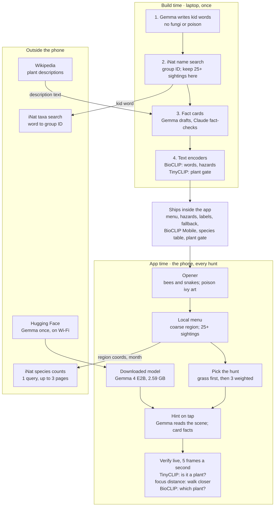

# wild-find — v1 PRD

Oct 5, 2026 · @Ashley

## Summary

wild-find sends kids 8 and up outside to find and photograph plant groups common in west Georgia; open-weight models on the phone check each photo and write hints, and no photo ever leaves the device.

|  |  |
| --- | --- |
| Platform | Native Android, Kotlin; two test phones: Samsung Galaxy S24 Ultra and Google Pixel 9 |
| Models | TinyCLIP ViT-8M gates plant vs not-plant and BioCLIP 2.5 Mobile verifies the plant group, both live in the camera; Gemma 4 E2B writes level-2 hints |
| Network | One iNaturalist query per hunt, requiring at most three paginated HTTP requests, sent with coarse region coordinates |
| Region | West Georgia region, key 34\_-85: a 75 km radius around (34, -85) that covers Carrollton |
| Content | Kid words common in the West Georgia region, filtered to the current calendar month |
| Hunt | First-ever hunt: grass tutorial, then 3 targets; every later hunt: 3 targets |
| Safety | Look. Photograph. Leave it where it grows. |
| Deadline | Internal ship deadline: October 11, 2026, 11:59 PM PDT |

## Problem and Audience

Kids get sent outside with no goal, so the screen wins; wild-find gives them something local to find and keeps the phone to a short clue.

- **Who:** kids 8 and up, playing on a parent or guardian's Android phone
- **Evidence:** firsthand, the three grown boys in my house
- **Prior art:** Seek by iNaturalist offers kid-safe, on-device ID with monthly challenges ([iNat](https://help.inaturalist.org/en/support/solutions/articles/151000169914-what-is-the-difference-between-inaturalist-and-seek-by-inaturalist-)); other kid nature-hunt apps exist, and the post names them once verified
- **Differentiator:** wild-find gives the child something local to find first, then uses the surrounding scene to help them find it, with all photo understanding done by open-weight models on the phone
- **Not claimed:** wild-find is not the first nature scavenger-hunt app

## Goals and Non-Goals

v1 succeeds when a kid finishes a real hunt outside and the verifier stays honest on photos it never trained its thresholds on.

**Goals**

- **Screen stays short:** a 3-target hunt takes under 20 minutes, with under 1 minute of screen time per target
- **Correct passes:** 90% or more of right-group holdout photos pass
- **No free passes:** 5% or fewer of wrong-group, non-plant, and screen holdout photos pass, and 5% or fewer of wide shots pass in the live field test
- **Grounded hints:** every fact in a 20-hint audit traces to its fact card
- **Works offline:** a cached hunt completes in airplane mode

**Non-goals for v1**

| Out of scope | Why |
| --- | --- |
| Medium and High difficulty | Needs the tiebreaker shot; v2 |
| Tiebreaker shot | v2 |
| Licensed reference photos | v3; category illustrations until then |
| Animals and bugs as targets | Kids chase them on screen and walk up to things that bite |
| Fungi as targets | BioCLIP Mobile was trained on plants only and can't verify them; a v2 candidate |
| Teaching look-alikes | Look-alikes simply pass at Low |
| Accounts, leaderboards, streaks, sharing, uploads, long-term progression | COPPA collection for no gameplay gain |
| iOS | No test device |
| Outside west Georgia | The v1 menu is built for the West Georgia region only |
| DigitalOcean category | Models stay on the phone |
| React | Animation-first native UI |

## Decisions

Every call below is settled; open items live in Open Questions.

| Area | Decision |
| --- | --- |
| Audience | Kids 8 and up; no taxonomy jargon in the UI |
| Platform | Native Android in Kotlin; two test phones, Samsung Galaxy S24 Ultra and Google Pixel 9; no iOS; no Vestige code |
| Repo | wild-find; new repo started inside the challenge window; MIT license |
| Runtime models | Open-weight only, all running on the phone |
| Model roles | TinyCLIP ViT-8M (MIT) gates plant vs not-plant on the reticle crop; BioCLIP 2.5 Mobile verifies the plant group on it; Gemma writes level-2 hints and never sits in the verify path; full BioCLIP 2.5 makes text embeddings at build time; Pl@ntNet rejected |
| Safety model | Look, photograph, leave it where it grows. Hazard recognition is an extra warning, never a safety guarantee; the app never tells a child a plant is safe |
| Difficulty | Selector exists; v1 ships Low only |
| Region | West Georgia region only, key 34\_-85 |
| Build-time Gemma | The same pinned `.litertlm` file the phone runs, driven by LiteRT-LM on the laptop |
| Targets | Kid words for real groups; Gemma generates candidates at build time; a word ships only after passing every build gate |
| Local filter | A word is eligible with 25+ research-grade sightings in the region for the current calendar month, across all available years |
| Hunt shape | First-ever hunt: grass tutorial, then 3 targets; later hunts: 3 targets; targets picked by sighting-weighted random |
| Look-alikes | Pass automatically; never taught in v1 |
| Framing | Live camera with a center reticle; "walk closer" when the focused autofocus distance in diopters (0 = infinity, larger = nearer) times the zoom ratio is under 2.0; pinch zoom allowed; no auto-capture without a focused reading; no Gemma boxes |
| Scoring | One star per find; one leave-it star when the plant is clearly still rooted |
| Hints | Three levels; Gemma reads the scene; facts only from fact cards; 20-word guard |
| Fact cards | Gemma drafts from Wikipedia; Claude fact-checks at build time in a manual Claude Code pass; the post discloses it |
| Location | Android coarse location only, rounded to whole degrees; the device is in a region only when its rounded key equals that region's key; the query always sends the region center, never device coordinates; manual region pick supported |
| Images | Category illustrations in v1; licensed photos in v3 |
| UI | Animation-first; Jetpack Compose hosts camera and chrome and plays sprite sheets for the opener and Briar, the mascot; no Rive, no React |
| Distribution | GitHub Release APK with BioCLIP Mobile and the TinyCLIP plant gate inside; Gemma downloads on first launch; outdoor demo video |
| Credits | README and About screen credit Gemma, BioCLIP 2.5 Mobile, BioCLIP 2.5, TinyCLIP, OpenCLIP, iNaturalist, and Wikipedia |
| Prize categories | Best Use of Gemma in; DigitalOcean dropped |
| Later versions | Tiebreaker shot in v2; licensed photos in v3 |

## User Stories

The kid hunts and leaves every plant where it grows; the parent sets the boundaries. The build queue lives in [stories.md](stories.md).

**Kid**

- As a kid, I want 3 local things to find so that going outside has a goal
- As a kid, I want an easy first win so that I learn how the game works
- As a kid, I want to learn the leave-it rule before I start so that I know to look, not touch
- As a kid, I want a hint when I'm stuck so that I keep looking instead of quitting
- As a kid, I want to know fast if my photo counts so that I get back to looking
- As a kid, I want a finish screen with my stars so that the hunt feels done

**Parent or guardian**

- As a parent, I want no account, no uploads, and coarse location only so that I don't hand over my kid's data
- As a parent, I want the app to never call a plant safe so that my kid leaves every plant alone
- As a parent, I want the big Gemma download on Wi-Fi only, with a storage check, so that it doesn't eat my data plan or fill my phone
- As a parent who denies location, I want a manual region pick so that the app still runs

**Edge cases**

- As a kid with no signal, I want my hunt to work from the cache or the bundled list so that the woods don't end the game
- As a kid outside west Georgia, I want a clear message so that I'm not handed an empty list
- As a kid who snaps a wide shot, I want "walk closer" so that I know what to fix
- As a kid who photographs a likely hazard plant, I want a warning so that I give it extra space

## Functional Requirements

Ten P0s ship the hunt; one P1 follows; four P2s shape the design now. Requirement IDs stay fixed.

### P0: Must ship

| ID | Requirement | Acceptance criteria |
| --- | --- | --- |
| R1 | Safety opener | First launch shows bees and snakes, with poison ivy drawn into the art; one rule: "Look. Photograph. Leave it where it grows."; no copy says safe, harmless, not poisonous, or okay to touch; replayable from the menu |
| R2 | Hunt list | One iNaturalist query per hunt, requiring at most three paginated HTTP requests: coarse region coordinates, current calendar month across all available years, plants, research grade; a result counts toward a target when its taxon id equals the target's taxon\_id or the target's taxon\_id is in its ancestor\_ids; eligible at 25+ sightings; fewer than 3 eligible widens the radius to 150 km once; cached under the versioned cache key; location denied falls back to a manual region pick; fewer than 3 eligible words shows the coverage message |
| R3 | Grass tutorial | The first-ever hunt opens with grass, followed by 3 normal targets; a grass close-up passes when TinyCLIP calls the reticle crop a plant and grass is in BioCLIP's top 3 of the fixed tutorial label set, the 11 labels Day 1 measured (Poaceae, Quercus, Polypodiopsida, Trifolium, Pinus, Taraxacum, and the 5 hazard species), never the hunt's full label universe (49 of 52 CC0 grass photos passed both on Day 1; BioCLIP top 3 alone passed 50 and top-1 alone 45; the one lawn the gate rejected scored a plant share of 0.39); the plant gate's labels include grass; the hazard check doesn't run during the tutorial, because 9 of 54 grass photos warned against the menu labels on Day 1 (1 of 54 against the species table), and the leave-it rule stays on screen; done in under 60 seconds; never repeats once completed |
| R4 | Target pick | 3 targets per hunt by sighting-weighted random from eligible words; a hazard is never a target |
| R5 | Verify | Follows the Runtime Logic verify table, live while the camera is open; a find needs the subject in close range and the target top-1 on the reticle crop at or above its verify\_floor for 3 frames in a row, then auto-captures; a hazard match shows a warning and gives no star; no result is ever presented as evidence of safety |
| R6 | Hints | Tap for a hint; levels 1 and 3 are precomputed from the fact card at hunt start; level 2 reads the camera frame from the moment the kid opens level 1, with no separate hint photo: the scene call starts on the level-1 tap, so the level-2 tap usually waits only for the short hint call; guards reject the target name, "I see", "there is", numbers not on the card, and anything over 20 words; retry once, then a template hint |
| R7 | Privacy | Android coarse location permission only; no fine location requested; coordinates rounded again before the query; no photo or precise location leaves the device; no account; no analytics |
| R8 | Offline | All three models on-device; a cached hunt completes in airplane mode; with no cache and no network, the bundled West Georgia fallback list runs the hunt |
| R9 | Model delivery | Gemma is the only download: pinned in Data Contracts; starts on its own at first launch while the opener plays; free storage checked before download, with a clear message showing the space needed; Wi-Fi only; resumable; progress shown; SHA-256 verified before load. Verify works before the download finishes; only level-2 hints wait |
| R15 | Hunt complete | The last target passes, a short success animation plays, the stars show, then Hunt Again or Home; only the current hunt's state persists |

### P1: Fast follow

| ID | Requirement | Acceptance criteria |
| --- | --- | --- |
| R10 | Leave-it star | One star per valid find; a second star when the photo clearly shows the plant still rooted; a held, picked, or cut plant gets no leave-it star; copy encourages leaving plants growing without sounding punitive; the model never judges whether touching was safe |

### P2: Design for, don't build

| ID | Requirement | Design constraint now |
| --- | --- | --- |
| R11 | Medium and High difficulty | Grouping level is a config value, not code |
| R12 | Tiebreaker shot | Verify accepts more than one capture per target |
| R13 | Licensed reference photos (v3) | A target's image comes from its icon\_category now and can take an attributed photo later |
| R14 | iOS | Game logic stays out of Android-only code |

## Non-Functional Requirements

Day-1 measurements on the test phone are in hole 4; heat and hint latency are still unmeasured.

| Area | Target | Verified by |
| --- | --- | --- |
| Privacy | No photo or precise location leaves the device; gameplay requests carry only coarse region coordinates plus ordinary request metadata such as IP address | Network log on the test phone |
| Offline | A full hunt runs in airplane mode from the cache or the bundled fallback list | Field test |
| Verify latency | Each analyzed live frame under 200 ms (TinyCLIP on the reticle crop and full frame, plus BioCLIP on up to both); the first eligible frame to Found under 1.5 s | Gate harness (S05) |
| Hint latency | Under 5 s for level 2; levels 1 and 3 are precomputed. The first vision call after Gemma loads pays about 3 s of one-time setup (first taps took 5.2 to 6.3 s on Oct 7), so Gemma runs one throwaway vision call right after loading. With that and the level-1 prefetch, level-2 taps took 0.9 to 1.8 s on the S24 Ultra, 2.9 s at worst with one guard retry (`docs/results/day-2/`, `docs/results/gate/`) | Gate harness (S05) |
| Download size | Gemma 2,588,147,712 bytes, fetched after install; the APK carries BioCLIP (46,986,589 bytes), the plant gate (about 33 MB), and the species table (about 17.5 MB) | Day-1 gate |
| Storage | Free space checked before the download starts | Day-1 gate |
| Memory | Gemma loads once per session and is released when the app goes to the background; RAM recorded | Day-1 gate |
| Heat and battery | A 20-minute session runs without immediate throttling (unmeasured) | Day-1 gate |
| Sunlight | High-contrast, large type that reads in direct sun | Field test |
| Accessibility | 48 dp touch targets; content descriptions; no color-only signals | Accessibility Scanner |
| Reading level | All kid-facing text at an age-8 level | Review |
| iNat etiquette | One query per hunt, requiring at most three paginated HTTP requests, plus one widened query only when fewer than 3 words are eligible; a User-Agent that names the app | Code review |

## Architecture

Build time runs once on the laptop and ships its files in the app; at app time no photo or precise location leaves the phone, and gameplay requests carry only coarse region coordinates plus ordinary request metadata.



The core loop runs live in the camera: TinyCLIP rejects non-plants, focus distance decides "walk closer", and BioCLIP verifies the plant group on the reticle crop.

## Build Pipeline

Runs once on the laptop in Python with uv; a word ships only after it passes every gate below.

1. **Candidates:** Gemma, run through LiteRT-LM on the pinned `.litertlm` file, writes kid words with the candidate prompt
2. **Resolve:** search `GET /v1/taxa?q=<word>`; keep Plantae only; prefer an exact common-name match; allow only genus, family, order, class, or phylum; more than one plausible match goes to manual review, never a guess
3. **Hazard drop:** the word's taxon contains, or sits inside, a hazard taxon
4. **Denylist drop:** the target name is itself an ambiguous or hazardous common name on the hand-maintained denylist
5. **Local keep:** 25+ research-grade sightings in the West Georgia region, all months combined; the app still filters by the current month
6. **Cards:** the Wikipedia description, found via the taxon's wikipedia\_url, goes to Gemma with the card prompt, which also picks icon\_category
7. **Fact-check:** in a manual Claude Code pass, Claude checks every fact against its source text, every word-to-taxon match, and every icon\_category; failures print for review
8. **Ship review:** Ashley reviews the final menu before it ships
9. **Embeddings:** the BioCLIP 2.5 ViT-H text encoder writes one vector per menu word and per tutorial label (text format per hole 3); the TinyCLIP text encoder writes the plant-gate vectors
10. **Fallback:** the same gates produce fallback\_october\_west\_georgia.json from October sightings, with no live counts
11. **Output:** menu.json, hazards.json, labels.npy, labels.json, the species table (species_table.npy, species_labels.json: the pinned taxa files plus any missing hazard species, with hazard flags), the plant gate (plant_gate.onnx, plant_gate.json), and the fallback file; BioCLIP Mobile ships as its pinned file

**Hazard species:** every *Toxicodendron* species (poison ivy, poison oak, poison sumac), *Phytolacca americana* (pokeweed), and *Solanum carolinense* (Carolina horsenettle); the fact-check confirms each.

**Plant-gate prompts** (exact strings, no trailing period, as measured on Day 1): "a photo of " followed by a plant, leaves, a tree, grass, a flower, moss, a fern vs a person, a child, a screen, a phone, a road, a sidewalk, a car, a dog, a room, a building. Scores are cosine similarity times TinyCLIP's learned scale (50.0), then softmaxed; a frame is a plant when the plant labels' combined share is over 0.5. Raw cosines softmaxed without the scale give different verdicts.

**Ambiguous-name denylist:** blocks target names that are themselves ambiguous or hazardous common names. A safe taxon is not blocked just because its word appears inside a longer hazard name, so oak stays. Starter list, maintained by hand: ivy, sumac. Berry-named targets are allowed unless the name itself is hazardous.

**Candidate prompt**

```
List plants a US 8-year-old could recognize by sight.
Output a JSON array of strings only.
Rules:
- Kid words, 1-2 words each: "oak", "fern", "cattail".
- No mushrooms or fungi. No poisonous plants.
- No cultivar or brand names.
```

**Card prompt**

```
Write a kid fact card from the plant description below.
Output JSON only: {"shape":"","where":"","fall_clue":"","icon_category":""}
Rules:
- Each fact 15 words or fewer, age-8 reading level.
- Use only facts stated in the input. No numbers unless the input has them.
- Visible features only: leaves, bark, seeds, where it grows.
- fall_clue = what a kid can see in October. None in the input: null.
- icon_category = one of: tree, flower, fern, grass, vine, shrub, moss, other.
- Never mention eating, touching, or picking.
```

## Data Contracts

Ten files ship in the app, one pinned model downloads once, and every cache entry is versioned so a rebuild never serves stale data.

**Shipped in the app**

| File | Contents | Made by |
| --- | --- | --- |
| menu.json | schema\_version, menu\_version, and targets (below) | Build pipeline |
| hazards.json | Hazard species (name, taxon\_id, scientific name) and the two opener hazards (name, rule) | Build pipeline, from NIOSH |
| species\_table.npy | BioCLIP Mobile's 4,271-species text table plus a row for each hazard species it lacks (today: *Toxicodendron pubescens*); 1024-d unit vectors | Build pipeline, from the pinned taxa\_table.npy |
| species\_labels.json | Scientific name per species\_table row, with a hazard flag | Build pipeline, from the pinned taxa\_labels.json |
| labels.npy | One 1024-d unit vector per menu word, plus the 11 fixed tutorial labels (R3) | BioCLIP 2.5 ViT-H text encoder |
| labels.json | schema\_version, the teacher pin and package versions, and a list parallel to labels.npy: id, kind (word or tutorial), scientific name, and prompt per row | Build pipeline |
| flora\_student\_fp32.onnx | BioCLIP 2.5 Mobile image encoder, fp32; pinned below and SHA-256 checked at build time | Build pipeline, from crazedcodernate/bioclip-2.5-mobile-fastvit @ 29b474ea2a5d72b4646f036ead9441e0a22a5c62 |
| plant\_gate.onnx | TinyCLIP ViT-8M/16 image encoder, fp32 (about 33 MB), with CLIP normalization baked in | Build pipeline, exported from the pinned TinyCLIP weights below |
| plant\_gate.json | Plant and not-plant labels, their 512-d TinyCLIP text vectors, and TinyCLIP's learned logit scale (exp(logit\_scale) = 50.0) | Build pipeline |
| fallback\_october\_west\_georgia.json | Targets common in the region in October; no live counts | Build pipeline |

**menu.json**

```json
{
  "schema_version": 1,
  "menu_version": "2026-10-07",
  "margin": null,
  "targets": [
    {
      "word": "oak",
      "taxon_id": 47851,
      "icon_category": "tree",
      "shape": "...",
      "where": "...",
      "fall_clue": "...",
      "verify_floor": null
    }
  ]
}
```

icon\_category is one of tree, flower, fern, grass, vine, shrub, moss, other. verify\_floor stays null until calibration, and null means no floor: top-1 and the plant gate decide. No shared default stands in, because on Day 1 correct reticle top-1 finds scored as low as 0.338 while non-plants topped a target at up to 0.616, so no single floor separates them.

**Pinned model artifacts**

| Model | Delivery | Repo and revision | File | Bytes | SHA-256 |
| --- | --- | --- | --- | --- | --- |
| Gemma 4 E2B | Downloaded on first launch | litert-community/gemma-4-E2B-it-litert-lm @ b3ca0d2f076785a8f4b2219ddbd2bdb99954eae1 | gemma-4-E2B-it.litertlm | 2,588,147,712 | 181938105e0eefd105961417e8da75903eacda102c4fce9ce90f50b97139a63c |
| TinyCLIP ViT-8M/16 | Build input; exported to plant\_gate.onnx inside the APK | wkcn/TinyCLIP-ViT-8M-16-Text-3M-YFCC15M @ a2a8c6eaa2549ad66eb7c31b85022bf58273a26c | model.safetensors | 93,812,468 | 9339ee3d736344d0ddcaa6c03edc9f89688f08caaea5401220885233da726fcc |
| BioCLIP species table | Bundled in the APK as species\_table.npy | crazedcodernate/bioclip-2.5-mobile-fastvit @ 29b474ea2a5d72b4646f036ead9441e0a22a5c62 | taxa\_table.npy, taxa\_labels.json | 17,494,144; 308,912 | 75626c967a00556f09bd6534d15c9c97c71ce37b0f3ae591187ba06d53377ae2; adb36a6af884fda71ad3d633c20ede66862b335915a282ea613604409b6d4d7f |
| BioCLIP 2.5 Mobile | Bundled in the APK | crazedcodernate/bioclip-2.5-mobile-fastvit @ 29b474ea2a5d72b4646f036ead9441e0a22a5c62 | flora\_student\_fp32.onnx | 46,986,589 | 8624d44af3727b69a41dc2035c37018a30753b8d9c93ab8801a0c724dd42510f |

The build-time text encoder is pinned too, laptop only: BioCLIP 2.5 ViT-H, imageomics/bioclip-2.5-vith14 @ 6e3d04e3d6522012c88181085c5ae666e14c45cd.

Gemma downloads from `https://huggingface.co/<repo>/resolve/<revision>/<file>`; the build fetches BioCLIP from the same URL shape. Check free storage first. Integrity comes from the SHA-256 above, read from the Hugging Face file listing on October 5 and 6, 2026, never from a displayed size. fp32 only: on the test phone, ONNX Runtime returned NaN for BioCLIP's fp16 file. Bundled models are generated build assets, never committed; the build regenerates them, and CI caches them. Text vectors that need the 3.9 GB teacher (labels.npy, appended hazard rows) are committed instead, so CI never downloads it.

**Cache entry**

```json
{
  "schema_version": 1,
  "menu_version": "2026-10-07",
  "region": "34_-85",
  "month": 10,
  "radius_km": 75,
  "sightings": { "47851": 272 }
}
```

radius\_km is 75, or 150 after the widen, so widened counts never pass as 75 km counts. A mismatch on schema\_version, menu\_version, region, month, or radius\_km discards the entry and refetches.

**Model inputs and outputs**

| Model | Input | Output |
| --- | --- | --- |
| TinyCLIP plant gate | 224 x 224 RGB reticle crop and full frame, values 0 to 1, rotation normalized (the same inputs BioCLIP gets; crops below); normalization is baked in | 512-d unit vector; softmax over 50.0 × cosine against plant\_gate.json rows |
| BioCLIP 2.5 Mobile | 224 x 224 RGB reticle crop, plus the full frame when TinyCLIP calls it a plant; values 0 to 1, rotation normalized; normalization is baked in. The reticle embedding is reused for target scoring | 1024-d unit vector; targets score against labels.npy rows, hazards against species\_table.npy rows |
| Gemma, scene call | Scene image plus the fixed tag list | JSON array of tags |
| Gemma, hint call | Fact card, tags, hint level | One line, 20 words or fewer |

**Crops** (the geometry Day 1 measured): both come from the rotation-normalized analysis frame, which is exactly the region the preview shows, because preview and analysis share one CameraX viewport. The kid frames the shot with the screen, so the screen is the photo, and the crops are taken from it as Day 1 took them from each photo. Analysis defaults to 1920 x 1440 (4:3); a phone without that size gets the closest smaller 4:3 size, then the closest larger. On a tall phone the visible strip's reticle square stays above 224 pixels down to about 960 x 720, so every crop downscales as Day 1's did. Full frame: the center square with side equal to the shorter edge. Reticle crop: the center square with side 60% of the shorter edge. Each is resized bicubic to 224 x 224 with Pillow's fixed-point resampler, which the phone reproduces bit for bit (JVM tests check every rotation against Pillow's own output). The on-screen circle is drawn inscribed in the reticle square after mapping analysis coordinates to preview coordinates, so the kid aims at the pixels the models read.

**The iNaturalist query**

```
GET https://api.inaturalist.org/v1/observations/species_counts
  ?lat=34&lng=-85&radius=75&month=<1-12>
  &iconic_taxa=Plantae&quality_grade=research&per_page=500&page=<1-3>
```

One query per hunt, requiring at most three paginated HTTP requests. month means the current calendar month across all available years; there is no year filter. A result counts toward a target when its taxon id equals the target's taxon\_id or the target's taxon\_id is in the result's ancestor\_ids.

## Runtime Logic

Verify runs on live camera frames, about 5 per second, with no Gemma call. Each frame is rotation-normalized once. TinyCLIP checks both the reticle crop and the full frame, and every region it calls a plant is scored against the full species table, so a hazard warns only when a hazard species ranks in BioCLIP's top 5 of about 4,272 known plants, not just against this hunt's menu. A hazard that dominates the reticle crop or the whole frame warns while a person, a screen, or a common safe plant almost never does; a small hazard off to the side of a bigger safe plant can be missed, and detection is an extra warning, never a guarantee. Then the reticle plant gate, then close range; a find needs the target on top for 3 frames in a row; no result ever means a plant is safe.

**Verify, checked in order**

| # | Condition | Kid sees | Star |
| --- | --- | --- | --- |
| 1 | In a region TinyCLIP calls a plant (the reticle crop, the full frame, or both), a hazard species ranks in the top 5 of the species table | "That might be a plant we leave extra space around." | No |
| 2 | TinyCLIP says the reticle crop isn't a plant | "Point the camera at a plant" | No |
| 3 | No focused reading: autofocus state is neither focused nor locked (passive focused or focused locked), or the distance is missing or negative | "Tap the plant to focus" | No |
| 4 | Focus distance in diopters times the zoom ratio is under 2.0, so the subject looks too small | "Walk closer" | No |
| 5 | The target is top-1 on the reticle crop, at or above its verify\_floor and past the margin if calibration adopts one, for 3 frames in a row | Auto-capture, then Found | Yes |
| 6 | Anything else | Reticle guidance ("Put the plant in the circle"), with the hint button | No |

The close-range rule was set on the test phone on Day 1 (S09): `LENS_FOCUS_DISTANCE × CONTROL_ZOOM_RATIO >= 2.0`, read only while autofocus reports focused. Unfocused frames park the lens near 0.2 diopters, which would read as far. BioCLIP target labels per frame: this hunt's targets and other locally eligible words; hazards score against the species table. The grass tutorial skips row 1 and scores only its fixed label set (R3). A missed hazard never reads as safe: "Look. Photograph. Leave it where it grows." stays the rule on every screen.

```
pass = target_score > runner_up_score          // top-1 is always required
       && target_score >= target.verify_floor
       && (margin == null || target_score - runner_up_score >= margin)

tutorial_pass = plant_gate(reticle) && rank(grass) <= 3   // grass tutorial only (R3)

hazard_warns(region) = plant_gate(region)
       && rank(best hazard species in species_table) <= 5
```

margin stays null until the calibration set sets it; null means top-1 alone decides. A tie with the runner-up is not top-1.

**Auto-capture** keeps the third matching frame's reticle crop, upright at analysis resolution, in memory for the Found screen. It is never written to storage or sent anywhere, and the streak starts over after it, so one target can take another capture (R12). The hazard rule needs no calibration: on Day 1 it caught 48 of 52 hazard photos (92%) and warned on 1 of 253 safe photos (0.4%); against the menu labels alone it warned on most magnolia, honeysuckle, and maple photos.

**Hints, one level per tap**

| Level | Built from | When | Example (made up) |
| --- | --- | --- | --- |
| 1 | Card: where | Precomputed at hunt start | "Ferns like shady, damp spots." |
| 2 | Card: where, plus scene tags | On tap; the scene is the camera frame from the level-1 tap, tagged while the kid reads level 1 | "That shady spot by the fence looks fern-friendly." |
| 3 | Card: shape | Precomputed at hunt start | "Look for leaves shaped like green feathers." |

Scene tags: shade, sun, water, tree, lawn, rocks, fence, path, woods edge. Guards run on every hint before it shows.

**Hunt complete**

1. The last target passes
2. A short success animation plays
3. Stars show: one per find, plus leave-it stars
4. Two choices: Hunt Again or Home

Only the current hunt's state persists; there is no history, streak, or sharing.

## Visual System

Briar and the opener play finished sprite sheets, one per state. A Rive rig was dropped on Oct 6: the rig sheets' parts were drawn at mismatched sizes and didn't assemble into a usable Briar, and the sheets were removed.

**Sprite sheet contract:** each state is `app/src/main/assets/briar/<state>.png` plus `<state>.json`. The PNG is a grid of equal frames, left to right, then top to bottom, on a transparent background. The JSON is `{"frame_width": 512, "frame_height": 512, "frames": 12, "columns": 4, "fps": 12, "loop": false}`. States: `welcome`, `searching`, `found`, `retry`, `complete`; until their art exists, every state plays `idle`. Briar isn't on every screen. A state sheet plays once, start to finish, and never loops; then `idle` loops until Briar leaves the screen, so `idle`'s last frame must flow into its first. The build finds each source frame by its outline and plants every frame on the same feet point, so a source sheet's frames needn't sit on an even grid.

| Asset | Used in | File |
| --- | --- | --- |
| Logo | Splash, About | Path pending (Open Questions) |
| Concept board | Poses, icon ideas, palette; reference only, broken alpha | assets/source/wild-find-sprite-1.png |
| UI direction 01 | Eight-screen review concept: first launch with the hint-download bar, grass tutorial, hunt map, live camera, hint, found, give it space, hunt complete; reference only | assets/source/wild-find-app-design.png |
| Briar idle loop | 16-frame rest-and-blink idle, source for `idle`; plays for every state until per-state art exists | assets/source/briar-rest-blink-16.png |
| Briar state sources | Finished per-state art, not yet packed: `welcome-blink-16` (16 frames, 4 × 4), and 32-frame 8 × 4 sheets on 512 px cells `rest-blink-32`, `searching-32`, `searching-hint-32`, `found-32`; drafts stay out of git in assets/generated/ until finished | assets/source/briar-*.png |
| Briar sprite sheets | Per-state sheets: welcome; searching or hint; found; retry; hunt complete | app/src/main/assets/briar/ (only `idle` so far) |
| Category icons | One per icon\_category: tree, flower, fern, grass, vine, shrub, moss, other | Path pending |
| Opener art | Bees and snakes, with poison ivy drawn in; a sprite sheet under the same contract | Path pending |

- Animation-first interactions; illustrations, not licensed photos, in v1
- Kid copy principle: "Look. Photograph. Leave it where it grows."
- Hazard copy: "That might be a plant we leave extra space around."
- Never in copy: safe, not poisonous, okay to touch, harmless

## Failure Handling

Every failure degrades to a playable hunt or a plain message; none crash or stall silently.

| Failure | App behavior |
| --- | --- |
| Location denied | Manual region pick |
| iNat unreachable, matching cache exists | Use the cached entry |
| iNat unreachable, no matching cache | Use the bundled West Georgia fallback list |
| iNat returns 429 | Wait per Retry-After, then use the cache or the fallback list |
| Cache entry mismatch (schema, menu, region, month, or radius) | Discard the entry and refetch |
| Fewer than 3 eligible words | Widen the radius to 150 km once, one extra query of up to three requests; still short, show "wild-find covers west Georgia for now" |
| Not enough free storage | Stop before downloading and show the space needed |
| Model download fails | Resume where it stopped; Wi-Fi only; the notification names the host that failed |
| SHA-256 mismatch | Delete the file; the next app launch downloads it again, since every retry costs a full 2.6 GB |
| Autofocus reports no focus distance | No auto-capture; the kid sees "Tap the plant to focus" until a reading arrives |
| Gemma too slow or out of memory | Release and reload once; then serve the template hint |
| A hint fails the guards twice | Template hint built from the card fields |
| Camera permission denied | Explain why the game needs it; the hunt can't start |
| App sent to the background mid-hunt | The current hunt's state is restored |

## Trade-offs

Each choice below buys speed or privacy for v1 and names the point where it gets revisited.

| Choice | What it costs | Revisit when |
| --- | --- | --- |
| BioCLIP 2.5 Mobile over full BioCLIP | Trained on plants only; misses 28% at species level | Medium difficulty ships, or the holdout set misses 90% |
| Species-table hazard rule | 17.5 MB more in the APK and one 4,272-row dot product per region; misses 4 of 52 Day-1 hazard photos | Holdout or field test shows a missed hazard rate above 10% |
| TinyCLIP plant gate before BioCLIP | A third model: about 33 MB in the APK and 40 ms per embedding on the test phone, twice per frame (S06); on the laptop it kept 176 of 176 plant photos and passed 2 of 63 non-plants on the full frame (175 and 3 on the reticle crop) | Holdout non-plant false-pass rate over 5% |
| Deterministic framing, no Gemma boxes | Approximate focus distance is coarse; clutter inside the reticle can lower the target's score | Holdout false-pass rate over 5%, or the field test shows wrong "walk closer" calls |
| Gemma downloads after install, not inside the APK | A second download after the app install; mitigated by starting it during the opener, and verify never waits on it. Bundling isn't possible: GitHub Releases caps each file at 2 GiB (2,147,483,648 bytes) and Gemma alone is 2,588,147,712. It would also store Gemma twice, because LiteRT-LM loads from a file path (`EngineConfig(modelPath)`) and an APK asset has none, so the app would copy it out: about 5.2 GB kept after install instead of 2.6 GB | Distribution moves to an app store with asset delivery |
| One iNaturalist query at app time | Needs signal once per region and month; coarse coordinates and request metadata reach iNaturalist | A fully offline mode is required |
| Menu built for one region | Testers outside west Georgia get the coverage message | A second region: rerun the build gates for it |
| Fixed 3-target hunt | Less variety per hunt | Field tests show hunts end too fast |
| Per-target verify floors | Calibration needs photos of every target | The menu outgrows one field day of photos |
| Look-alikes pass automatically | A kid may learn the wrong name | The v2 tiebreaker shot |
| Native Android only | No iOS | An iOS test device is available |
| Claude fact-checks at build time | A closed model in build tooling; the post must say so | An open model checks as well |
| No analytics | Field failures stay invisible | After the hackathon, with parental consent |

## Remaining Holes

No blockers remain; every hole below closes or falls back during the Day-1 gate or the field test. Resolved holes moved into Decisions and Requirements, and numbers stay fixed so references hold.

| # | Hole | Why it matters | Fix | Severity |
| --- | --- | --- | --- | --- |
| 3 | Label text format | Day 1: with common names, a white oak photo scored "poison oak" top-1 on both the teacher and the mobile model; scientific names put oak top-1 on both | BioCLIP labels embed as "a photo of <scientific name>."; confirm on the calibration set | High |
| 4 | Latency | Day 1 measured parts, not the whole per-frame path: one BioCLIP embedding takes 45 to 65 ms (one run 132 ms) and one TinyCLIP embedding 40 ms. A live frame runs TinyCLIP twice plus BioCLIP up to twice: on Oct 7 the whole path took 163 to 305 ms across two runs on the test phone with both regions plants (a 224-pixel test frame, `docs/results/day-2/`), with BioCLIP alone swinging from 80 to 193 ms, so frames can miss 200 ms; live camera frames at the pinned analysis resolution come from the gate harness. Gemma (hints only) loads in 4.0 s warm, 9.9 s first ever, peaks at 2.9 GB, and took 2.3 to 2.9 s per warm vision call. Level-2 hint latency, measured Oct 7: 5.2 to 6.3 s for a first tap after a cold load, 0.9 to 1.8 s once Gemma warms its vision path after loading and level 1 starts the scene call (see Hint latency) | The gate harness (S05) benchmarks the full per-frame verify path and the hint call on the phone; if a frame runs over 200 ms, analyze fewer frames a second | High |
| 5 | Kids read hints on screen | Reading pulls eyes down, against the theme | Read hints aloud with Android's on-device text-to-speech; confirm an offline voice on the test phone | High |
| 8 | Loose Gemma boxes | Resolved on Day 1: verify no longer uses Gemma boxes | None | Low |
| 10 | Heat and battery | Live BioCLIP at about 5 frames a second plus the camera; Gemma only on hint taps | The gate harness runs a 20-minute live-camera session | Medium |
| 12 | Home Wi-Fi download | A Vestige model download broke when Hugging Face moved its redirect CDN and the app had the old host pinned; filtered networks can also block the CDN | Pin the Hugging Face start URL, never the CDN host; trust bytes + SHA-256; re-resolve redirects on resume; the Day-1 gate runs the full download and an interrupted resume on the test phone | High |
| 13 | No telemetry | Field failures stay invisible by design | Debug builds only: a local log the developer can export | Medium |
| 17 | BioCLIP Mobile vs non-plant labels | Laptop side resolved on Day 1: 16 of 63 free non-plant photos scored a plant target top-1 on the reticle crop (20 of 63 on the full frame), and a pair of sneakers scored oak (0.605) above a real oak (0.572). TinyCLIP ViT-8M kept 176 of 176 plant photos and passed 2 of 63 non-plants on the full frame, so it gates every frame first. The fp32 export now matches the laptop on the phone (cosine 0.99999999, same plant share) and reproduces all 307 Day-1 reticle verdicts | Resolved (S06) | Low |
| 18 | Gemma file variant | Resolved on Day 1: the pinned generic file loads and runs on the GPU backend, so the GPU-only build isn't needed | Keep the pinned file | Low |
| 19 | Approximate focus distance | Resolved on the test phone for a can at desk range (S09): focused readings split far (1.8 or less) from closer (2.0 or more) in three runs, and every lens reports about the same distance as zoom switches lenses. Unmeasured outdoors on plants and beyond about 1 m | Rule: diopters × zoom ≥ 2.0 while focused; recheck wide-shot calls in the field test (S52) | Medium |

## Success Metrics

Acceptance metrics come from the holdout set, which never touches calibration; the lagging metric comes from the challenge.

| Metric | Type | Success | Stretch | Method |
| --- | --- | --- | --- | --- |
| Correct-pass rate | Leading | 90% | 95% | Right-group holdout photos |
| False-pass rate | Leading | 5% or less | 0% | Wrong-group, non-plant, and screen holdout photos; wide shots on the test phone with live autofocus in the field test |
| Screen time per target | Leading | Under 60 s | Under 30 s | Stopwatch during the field test |
| Find rate after a hint | Leading | 2 of 3 stuck targets found | 3 of 3 | Field test log |
| Verify latency | Leading | Each live frame under 200 ms | Under 100 ms | Gate harness timing |
| Challenge placement | Lagging | Best Use of Gemma | Overall winner | Results, week of October 12 |

## Open Questions

Two questions block the build; three can wait.

**Blocking**

- [ ] Visual: when do Briar's five sprite sheets and the opener sheet land? Logo and category icons still need paths
- [ ] Legal: do coarse location plus whole-degree rounding clear the precise-geolocation bar?

**Non-blocking**

- [ ] Product: read hints aloud (hole 5)?
- [ ] Data: does a runner-up margin cut false passes? Decide from the calibration set
- [ ] Post: verify Snappit, ForestForay Kids, and SnapScout before naming them as prior art

## Milestones

Day 1 is a go or no-go gate: every runtime model must run on the test phone before UI or content work starts.

1. Oct 6, 2026: the Day-1 gate. All must pass:
   - BioCLIP Mobile loads on the test phone
   - Android output matches Python for the same input
   - Build-time text embeddings score correctly against mobile image embeddings
   - Gemma loads without running out of memory
   - Gemma answers a vision prompt (boxes measured on Day 1, then dropped from verify)
   - Autofocus distance read live from the back camera
   - End-to-end verify latency measured
   - Hint latency measured
   - Phone RAM recorded
   - A 20-minute session doesn't throttle right away
   - Scene and non-plant labels tested against BioCLIP Mobile
   - TinyCLIP plant gate matches the laptop on the phone
   - The full first-launch Gemma download succeeds
   - Resume after an interrupted download succeeds
   - SHA-256 verification succeeds
   - Low-storage handling tested
2. Oct 7, 2026: build pipeline outputs menu.json, hazards.json, labels, and the fallback file; denylist and final menu reviewed; final assets wired in
3. Oct 8, 2026: verify loop end to end; collect about 30 calibration photos and 20 to 30 holdout photos from free CC0 or public-domain sources, stored apart; the holdout includes free non-plant negatives (screens, people, pavement)
4. Oct 9, 2026: outdoor field test, including live wide shots for the wide-shot false-pass rate; per-target floors and the margin decision come from the calibration set only; hints with guards; hunt-complete flow
5. Oct 10, 2026: holdout acceptance metrics; record the outdoor demo; draft the post, disclosing the Claude fact-check
6. Oct 11, 2026: internal ship deadline, 11:59 PM PDT

Gate outcomes: the scene labels failed, so TinyCLIP gates non-plants; Gemma was too slow for verify, so it writes hints only.

## Sources

- [Touch Grass challenge post](https://dev.to/devteam/join-the-hacktoberfest-open-source-ai-challenge-week-1-touch-grass-2450-in-prizes-across-17-4pom) and [HF26 hub and FAQ](https://dev.to/challenges/hf26)
- [BioCLIP 2.5 Mobile model card](https://huggingface.co/crazedcodernate/bioclip-2.5-mobile-fastvit) and [BioCLIP 2 model card](https://huggingface.co/imageomics/bioclip-2)
- [pybioclip](https://pypi.org/project/pybioclip) for rank-level prediction
- [TinyCLIP paper](https://arxiv.org/pdf/2309.12314) and [TinyCLIP ViT-8M/16 weights](https://huggingface.co/wkcn/TinyCLIP-ViT-8M-16-Text-3M-YFCC15M), MIT
- [Gemma 4 on Hugging Face](https://huggingface.co/blog/gemma4) for vision and box output
- [Gemma 4 E2B LiteRT-LM repository](https://huggingface.co/litert-community/gemma-4-E2B-it-litert-lm), the pinned artifact source
- [Seek vs iNaturalist](https://help.inaturalist.org/en/support/solutions/articles/151000169914-what-is-the-difference-between-inaturalist-and-seek-by-inaturalist-)
- [iNat rate limits](https://forum.inaturalist.org/t/discrepancy-between-documented-rate-limit-observed-rate-limit/8612)
- [Pl@ntNet API docs](https://my.plantnet.org/doc/getting-started/introduction) and [PlantCLEF 2024 overview](https://arxiv.org/pdf/2509.15768)
- [Amended COPPA rule](https://www.federalregister.gov/documents/2025/04/22/2025-05904/childrens-online-privacy-protection-rule)
- [NIOSH poisonous plants](https://www.cdc.gov/niosh/outdoor-workers/about/poisonous-plants.html) and [public-domain fact sheet](https://stacks.cdc.gov/view/cdc/5684)
- [US mushroom exposure data](https://pubmed.ncbi.nlm.nih.gov/30062915/)
- [Hugging Face download hosts](https://discuss.huggingface.co/t/how-to-get-a-list-of-all-huggingface-download-redirections-to-whitelist/30486)
- Live iNaturalist pull for the West Georgia region (34, -85), October, run while drafting this PRD: 1,033 plant species
