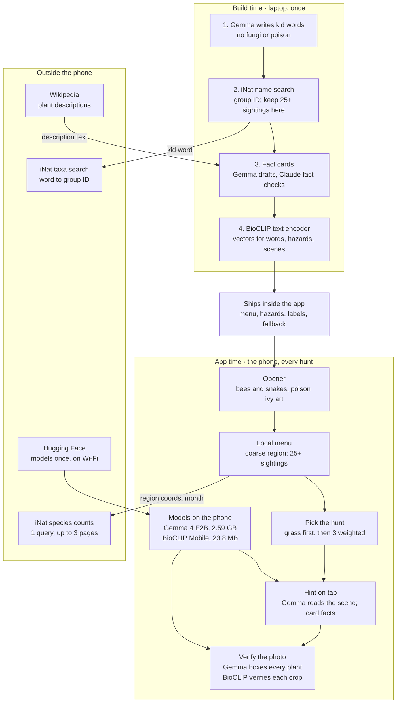

# wild-find — v1 PRD

Oct 5, 2026 · @Ashley

## Summary

wild-find sends kids 8 and up outside to find and photograph plant groups common in west Georgia; open-weight models on the phone check each photo and write hints, and no photo ever leaves the device.

|  |  |
| --- | --- |
| Platform | Native Android, Kotlin; one Android test phone |
| Models | Gemma 4 E2B boxes plants and writes hints; BioCLIP 2.5 Mobile verifies the plant group |
| Network | One iNaturalist query per hunt, requiring at most three paginated HTTP requests, sent with coarse region coordinates |
| Region | West Georgia region, key 34\_-85: a 75 km radius around (34, -85) that covers Carrollton |
| Content | Kid words common in the West Georgia region, filtered to the current calendar month |
| Hunt | First-ever hunt: grass tutorial, then 3 targets; every later hunt: 3 targets |
| Safety | Look. Photograph. Leave it where it grows. |
| Deadline | Internal ship deadline: October 11, 2026, 11:59 PM PDT |

## Problem and Audience

Kids get sent outside with no goal, so the screen wins; wild-find gives them something local to find and keeps the phone to a short clue.

- **Who:** kids 8 and up, playing on a parent or guardian's Android phone
- **Evidence:** firsthand, the three grown boys in my house
- **Prior art:** Seek by iNaturalist offers kid-safe, on-device ID with monthly challenges ([iNat](https://help.inaturalist.org/en/support/solutions/articles/151000169914-what-is-the-difference-between-inaturalist-and-seek-by-inaturalist-)); other kid nature-hunt apps exist, and the post names them once verified
- **Differentiator:** wild-find gives the child something local to find first, then uses the surrounding scene to help them find it, with all photo understanding done by open-weight models on the phone
- **Not claimed:** wild-find is not the first nature scavenger-hunt app

## Goals and Non-Goals

v1 succeeds when a kid finishes a real hunt outside and the verifier stays honest on photos it never trained its thresholds on.

**Goals**

- **Screen stays short:** a 3-target hunt takes under 20 minutes, with under 1 minute of screen time per target
- **Correct passes:** 90% or more of right-group holdout photos pass
- **No free passes:** 5% or fewer of wrong-group, non-plant, screen, and wide-shot holdout photos pass
- **Grounded hints:** every fact in a 20-hint audit traces to its fact card
- **Works offline:** a cached hunt completes in airplane mode

**Non-goals for v1**

| Out of scope | Why |
| --- | --- |
| Medium and High difficulty | Needs the tiebreaker shot; v2 |
| Tiebreaker shot | v2 |
| Licensed reference photos | v3; category illustrations until then |
| Animals and bugs as targets | Kids chase them on screen and walk up to things that bite |
| Fungi as targets | BioCLIP Mobile was trained on plants only and can't verify them; a v2 candidate |
| Teaching look-alikes | Look-alikes simply pass at Low |
| Accounts, leaderboards, streaks, sharing, uploads, long-term progression | COPPA collection for no gameplay gain |
| iOS | No test device |
| Outside west Georgia | The v1 menu is built for the West Georgia region only |
| DigitalOcean category | Models stay on the phone |
| React | Animation-first native UI |

## Decisions

Every call below is settled; open items live in Open Questions.

| Area | Decision |
| --- | --- |
| Audience | Kids 8 and up; no taxonomy jargon in the UI |
| Platform | Native Android in Kotlin; one Android test phone; no iOS; no Vestige code |
| Repo | wild-find; new repo started inside the challenge window; MIT license |
| Runtime models | Open-weight only, all running on the phone |
| Model roles | Gemma boxes plants and writes hints; BioCLIP 2.5 Mobile verifies the plant group; full BioCLIP 2.5 makes text embeddings at build time; Pl@ntNet rejected |
| Safety model | Look, photograph, leave it where it grows. Hazard recognition is an extra warning, never a safety guarantee; the app never tells a child a plant is safe |
| Difficulty | Selector exists; v1 ships Low only |
| Region | West Georgia region only, key 34\_-85 |
| Build-time Gemma | The same pinned `.litertlm` file the phone runs, driven by LiteRT-LM on the laptop |
| Targets | Kid words for real groups; Gemma generates candidates at build time; a word ships only after passing every build gate |
| Local filter | A word is eligible with 25+ research-grade sightings in the region for the current calendar month, across all available years |
| Hunt shape | First-ever hunt: grass tutorial, then 3 targets; later hunts: 3 targets; targets picked by sighting-weighted random |
| Look-alikes | Pass automatically; never taught in v1 |
| Framing | A plant box must cover 15% of the frame, or the kid hears "walk closer" |
| Scoring | One star per find; one leave-it star when the plant is clearly still rooted |
| Hints | Three levels; Gemma reads the scene; facts only from fact cards; 20-word guard |
| Fact cards | Gemma drafts from Wikipedia; Claude fact-checks at build time in a manual Claude Code pass; the post discloses it |
| Location | Android coarse location only, rounded to whole degrees; the device is in a region only when its rounded key equals that region's key; the query always sends the region center, never device coordinates; manual region pick supported |
| Images | Category illustrations in v1; licensed photos in v3 |
| UI | Animation-first; Jetpack Compose hosts camera and chrome; Rive state machines animate the opener and Briar, the mascot; no React |
| Distribution | GitHub Release APK plus first-launch model download; outdoor demo video |
| Credits | README and About screen credit Gemma, BioCLIP 2.5 Mobile, BioCLIP 2.5, OpenCLIP, iNaturalist, and Wikipedia |
| Prize categories | Best Use of Gemma in; DigitalOcean dropped |
| Later versions | Tiebreaker shot in v2; licensed photos in v3 |

## User Stories

The kid hunts and leaves every plant where it grows; the parent sets the boundaries. The build queue lives in [stories.md](stories.md).

**Kid**

- As a kid, I want 3 local things to find so that going outside has a goal
- As a kid, I want an easy first win so that I learn how the game works
- As a kid, I want to learn the leave-it rule before I start so that I know to look, not touch
- As a kid, I want a hint when I'm stuck so that I keep looking instead of quitting
- As a kid, I want to know fast if my photo counts so that I get back to looking
- As a kid, I want a finish screen with my stars so that the hunt feels done

**Parent or guardian**

- As a parent, I want no account, no uploads, and coarse location only so that I don't hand over my kid's data
- As a parent, I want the app to never call a plant safe so that my kid leaves every plant alone
- As a parent, I want the big model download on Wi-Fi only, with a storage check, so that it doesn't eat my data plan or fill my phone
- As a parent who denies location, I want a manual region pick so that the app still runs

**Edge cases**

- As a kid with no signal, I want my hunt to work from the cache or the bundled list so that the woods don't end the game
- As a kid outside west Georgia, I want a clear message so that I'm not handed an empty list
- As a kid who snaps a wide shot, I want "walk closer" so that I know what to fix
- As a kid who photographs a likely hazard plant, I want a warning so that I give it extra space

## Functional Requirements

Ten P0s ship the hunt; one P1 follows; four P2s shape the design now. Requirement IDs stay fixed.

### P0: Must ship

| ID | Requirement | Acceptance criteria |
| --- | --- | --- |
| R1 | Safety opener | First launch shows bees and snakes, with poison ivy drawn into the art; one rule: "Look. Photograph. Leave it where it grows."; no copy says safe, harmless, not poisonous, or okay to touch; replayable from the menu |
| R2 | Hunt list | One iNaturalist query per hunt, requiring at most three paginated HTTP requests: coarse region coordinates, current calendar month across all available years, plants, research grade; a result counts toward a target when its taxon id equals the target's taxon\_id or the target's taxon\_id is in its ancestor\_ids; eligible at 25+ sightings; fewer than 3 eligible widens the radius to 150 km once; cached under the versioned cache key; location denied falls back to a manual region pick; fewer than 3 eligible words shows the coverage message |
| R3 | Grass tutorial | The first-ever hunt opens with grass, followed by 3 normal targets; any grass close-up passes; lawn is not a scene label for this target; done in under 60 seconds; never repeats once completed |
| R4 | Target pick | 3 targets per hunt by sighting-weighted random from eligible words; a hazard is never a target |
| R5 | Verify | Follows the Runtime Logic verify table; a pass needs a box covering 15%+ of the frame with the target top-1 at or above its verify\_floor; a hazard match shows a warning and gives no star; no result is ever presented as evidence of safety |
| R6 | Hints | Tap for a hint; levels 1 and 3 are precomputed from the fact card at hunt start; level 2 uses the most recent failed verify photo, otherwise the current camera frame at tap time, with no separate hint photo; guards reject the target name, "I see", "there is", numbers not on the card, and anything over 20 words; retry once, then a template hint |
| R7 | Privacy | Android coarse location permission only; no fine location requested; coordinates rounded again before the query; no photo or precise location leaves the device; no account; no analytics |
| R8 | Offline | Both models on-device; a cached hunt completes in airplane mode; with no cache and no network, the bundled West Georgia fallback list runs the hunt |
| R9 | Model delivery | Pinned artifacts from Data Contracts; free storage checked before download, with a clear message showing the space needed; Wi-Fi only; resumable; progress shown; SHA-256 verified before load |
| R15 | Hunt complete | The last target passes, a short success animation plays, the stars show, then Hunt Again or Home; only the current hunt's state persists |

### P1: Fast follow

| ID | Requirement | Acceptance criteria |
| --- | --- | --- |
| R10 | Leave-it star | One star per valid find; a second star when the photo clearly shows the plant still rooted; a held, picked, or cut plant gets no leave-it star; copy encourages leaving plants growing without sounding punitive; the model never judges whether touching was safe |

### P2: Design for, don't build

| ID | Requirement | Design constraint now |
| --- | --- | --- |
| R11 | Medium and High difficulty | Grouping level is a config value, not code |
| R12 | Tiebreaker shot | Verify accepts more than one photo per target |
| R13 | Licensed reference photos (v3) | A target's image comes from its icon\_category now and can take an attributed photo later |
| R14 | iOS | Game logic stays out of Android-only code |

## Non-Functional Requirements

Latency, heat, and memory targets are guesses until the Day-1 gate measures them on the test phone.

| Area | Target | Verified by |
| --- | --- | --- |
| Privacy | No photo or precise location leaves the device; gameplay requests carry only coarse region coordinates plus ordinary request metadata such as IP address | Network log on the test phone |
| Offline | A full hunt runs in airplane mode from the cache or the bundled fallback list | Field test |
| Verify latency | Under 5 s from shutter to result (unmeasured) | Day-1 gate |
| Hint latency | Under 5 s for level 2; levels 1 and 3 are precomputed (unmeasured) | Day-1 gate |
| Download size | Gemma 2,588,147,712 bytes plus BioCLIP 23,849,085 bytes, fetched after install | Day-1 gate |
| Storage | Free space checked before the download starts | Day-1 gate |
| Memory | Gemma loads once per session and is released when the app goes to the background; RAM recorded | Day-1 gate |
| Heat and battery | A 20-minute session runs without immediate throttling (unmeasured) | Day-1 gate |
| Sunlight | High-contrast, large type that reads in direct sun | Field test |
| Accessibility | 48 dp touch targets; content descriptions; no color-only signals | Accessibility Scanner |
| Reading level | All kid-facing text at an age-8 level | Review |
| iNat etiquette | One query per hunt, requiring at most three paginated HTTP requests, plus one widened query only when fewer than 3 words are eligible; a User-Agent that names the app | Code review |

## Architecture

Build time runs once on the laptop and ships its files in the app; at app time no photo or precise location leaves the phone, and gameplay requests carry only coarse region coordinates plus ordinary request metadata.



The highlighted box is the core loop: Gemma finds the plants, and BioCLIP verifies the plant group.

## Build Pipeline

Runs once on the laptop in Python with uv; a word ships only after it passes every gate below.

1. **Candidates:** Gemma, run through LiteRT-LM on the pinned `.litertlm` file, writes kid words with the candidate prompt
2. **Resolve:** search `GET /v1/taxa?q=<word>`; keep Plantae only; prefer an exact common-name match; allow only genus, family, order, class, or phylum; more than one plausible match goes to manual review, never a guess
3. **Hazard drop:** the word's taxon contains, or sits inside, a hazard taxon
4. **Denylist drop:** the target name is itself an ambiguous or hazardous common name on the hand-maintained denylist
5. **Local keep:** 25+ research-grade sightings in the West Georgia region, all months combined; the app still filters by the current month
6. **Cards:** the Wikipedia description, found via the taxon's wikipedia\_url, goes to Gemma with the card prompt, which also picks icon\_category
7. **Fact-check:** in a manual Claude Code pass, Claude checks every fact against its source text, every word-to-taxon match, and every icon\_category; failures print for review
8. **Ship review:** Ashley reviews the final menu before it ships
9. **Embeddings:** the BioCLIP 2.5 ViT-H text encoder writes one vector per menu word, hazard, and scene label (text format per hole 3)
10. **Fallback:** the same gates produce fallback\_october\_west\_georgia.json from October sightings, with no live counts
11. **Output:** menu.json, hazards.json, labels.npy, labels.json, and the fallback file

**Hazard plant labels:** poison ivy, poison oak, poison sumac, pokeweed, Carolina horsenettle; the fact-check confirms each.

**Scene labels:** lawn, field, weedy garden bed, pavement, person, screen; Day 1 tests whether BioCLIP Mobile handles them (hole 17).

**Ambiguous-name denylist:** blocks target names that are themselves ambiguous or hazardous common names. A safe taxon is not blocked just because its word appears inside a longer hazard name, so oak stays. Starter list, maintained by hand: ivy, sumac. Berry-named targets are allowed unless the name itself is hazardous.

**Candidate prompt**

```
List plants a US 8-year-old could recognize by sight.
Output a JSON array of strings only.
Rules:
- Kid words, 1-2 words each: "oak", "fern", "cattail".
- No mushrooms or fungi. No poisonous plants.
- No cultivar or brand names.
```

**Card prompt**

```
Write a kid fact card from the plant description below.
Output JSON only: {"shape":"","where":"","fall_clue":"","icon_category":""}
Rules:
- Each fact 15 words or fewer, age-8 reading level.
- Use only facts stated in the input. No numbers unless the input has them.
- Visible features only: leaves, bark, seeds, where it grows.
- fall_clue = what a kid can see in October. None in the input: null.
- icon_category = one of: tree, flower, fern, grass, vine, shrub, moss, other.
- Never mention eating, touching, or picking.
```

## Data Contracts

Five files ship in the app, two pinned models download once, and every cache entry is versioned so a rebuild never serves stale data.

**Shipped in the app**

| File | Contents | Made by |
| --- | --- | --- |
| menu.json | schema\_version, menu\_version, and targets (below) | Build pipeline |
| hazards.json | Hazard plant labels (name, taxon\_id) and the two opener hazards (name, rule) | Build pipeline, from NIOSH |
| labels.npy | One 1024-d unit vector per menu word, hazard, and scene label | BioCLIP 2.5 ViT-H text encoder |
| labels.json | Parallel list: id and kind (word, hazard, scene) | Build pipeline |
| fallback\_october\_west\_georgia.json | Targets common in the region in October; no live counts | Build pipeline |

**menu.json**

```json
{
  "schema_version": 1,
  "menu_version": "2026-10-07",
  "targets": [
    {
      "word": "oak",
      "taxon_id": 47851,
      "icon_category": "tree",
      "shape": "...",
      "where": "...",
      "fall_clue": "...",
      "verify_floor": null
    }
  ]
}
```

icon\_category is one of tree, flower, fern, grass, vine, shrub, moss, other. verify\_floor stays null until calibration; development builds use one shared default until then.

**Downloaded on first launch, pinned**

| Model | Repo and revision | File | Bytes | SHA-256 |
| --- | --- | --- | --- | --- |
| Gemma 4 E2B | litert-community/gemma-4-E2B-it-litert-lm @ b3ca0d2f076785a8f4b2219ddbd2bdb99954eae1 | gemma-4-E2B-it.litertlm | 2,588,147,712 | 181938105e0eefd105961417e8da75903eacda102c4fce9ce90f50b97139a63c |
| BioCLIP 2.5 Mobile | crazedcodernate/bioclip-2.5-mobile-fastvit @ 29b474ea2a5d72b4646f036ead9441e0a22a5c62 | flora\_student\_fp16.onnx | 23,849,085 | b152ee0b3fe8f7b6e01f27a580fa74fbec53c0519e4dccaebdb9e289d140c579 |

The build-time text encoder is pinned too, laptop only: BioCLIP 2.5 ViT-H, imageomics/bioclip-2.5-vith14 @ 6e3d04e3d6522012c88181085c5ae666e14c45cd.

Download from `https://huggingface.co/<repo>/resolve/<revision>/<file>`. Check free storage first. Integrity comes from the SHA-256 above, read from the Hugging Face file listing on October 5, 2026, never from a displayed size.

**Cache entry**

```json
{
  "schema_version": 1,
  "menu_version": "2026-10-07",
  "region": "34_-85",
  "month": 10,
  "sightings": { "47851": 272 }
}
```

A mismatch on schema\_version, menu\_version, region, or month discards the entry and refetches.

**Model inputs and outputs**

| Model | Input | Output |
| --- | --- | --- |
| BioCLIP 2.5 Mobile | 224 x 224 RGB, values 0 to 1, rotation normalized; normalization is baked in | 1024-d unit vector; score is a dot product with labels.npy rows |
| Gemma, box call | Rotation-normalized photo plus "box every plant" | Box JSON (below) |
| Gemma, scene call | Scene image plus the fixed tag list | JSON array of tags |
| Gemma, hint call | Fact card, tags, hint level | One line, 20 words or fewer |

**Gemma box JSON**

```json
{ "boxes": [ { "x1": 120, "y1": 180, "x2": 780, "y2": 920 } ] }
```

- Integers on a 0 to 1000 grid; (x1, y1) is top-left, (x2, y2) is bottom-right
- Values slightly outside 0 to 1000 are clamped; inverted or zero-area boxes are rejected
- More than 5 boxes: keep the 5 largest by area
- Coordinates scale to the rotation-normalized image before the 15% pad and crop
- Malformed JSON: retry once, then run the full-frame scene check

**The iNaturalist query**

```
GET https://api.inaturalist.org/v1/observations/species_counts
  ?lat=34&lng=-85&radius=75&month=<1-12>
  &iconic_taxa=Plantae&quality_grade=research&per_page=500&page=<1-3>
```

One query per hunt, requiring at most three paginated HTTP requests. month means the current calendar month across all available years; there is no year filter. A result counts toward a target when its taxon id equals the target's taxon\_id or the target's taxon\_id is in the result's ancestor\_ids.

## Runtime Logic

The hazard check runs first on every photo as an extra warning; a find needs a big enough box with the target on top; no result ever means a plant is safe.

**Verify, checked in order**

| # | Condition | Kid sees | Star |
| --- | --- | --- | --- |
| 1 | A hazard label is top-1 in any box or the full frame | "That might be a plant we leave extra space around." | No |
| 2 | Gemma returns no valid plant box | Scene message, such as "Lots of grass! Look closer for the clover" | No |
| 3 | The target is top-1 in a box covering 15%+ of the frame, at or above its verify\_floor, and past the margin if calibration adopts one | Found | Yes |
| 4 | The target is top-1 only in a smaller box | "Walk closer" | No |
| 5 | Anything else | "Not quite, keep looking" plus the hint button | No |

Scoring labels per photo: this hunt's targets, other locally eligible words, hazards, and scene labels. The grass tutorial drops lawn from the scene labels. A missed hazard never reads as safe: "Look. Photograph. Leave it where it grows." stays the rule on every screen.

If Day 1 shows BioCLIP Mobile can't handle the scene and non-plant labels, Gemma answers plant, non-plant, or screen, and BioCLIP keeps plant-group verification only.

```
pass = target_score >= target.verify_floor
       && (margin == null || target_score - runner_up_score >= margin)
```

margin stays null unless the calibration set shows it cuts false passes.

**Hints, one level per tap**

| Level | Built from | When | Example (made up) |
| --- | --- | --- | --- |
| 1 | Card: where | Precomputed at hunt start | "Ferns like shady, damp spots." |
| 2 | Card: where, plus scene tags | On tap; the scene is the last failed verify photo, else the current camera frame | "That shady spot by the fence looks fern-friendly." |
| 3 | Card: shape | Precomputed at hunt start | "Look for leaves shaped like green feathers." |

Scene tags: shade, sun, water, tree, lawn, rocks, fence, path, woods edge. Guards run on every hint before it shows.

**Hunt complete**

1. The last target passes
2. A short success animation plays
3. Stars show: one per find, plus leave-it stars
4. Two choices: Hunt Again or Home

Only the current hunt's state persists; there is no history, streak, or sharing.

## Visual System

The final generated assets are the source of truth for Briar's look; the Rive rig is built from the layered rigging sheet; frame-by-frame sprite sheets are out because AI-drawn frames drift in proportion and can't play as cycles.

| Asset | Used in | File |
| --- | --- | --- |
| Logo | Splash, About | Path pending (Open Questions) |
| Briar body parts | Head, torso (front, back, sides), limbs, paws, tail segments, scarf, backpack, props; source for the Rive rig | assets/source/wild-find-briar-master-rig-1.png |
| Briar face parts | Eyes, irises, pupils, lids, brows, mouths and interiors, teeth, noses, blush, whiskers | assets/source/wild-find-briar-master-rig-2.png |
| Concept board | Poses, icon ideas, palette; reference only, broken alpha | assets/source/wild-find-sprite-1.png |
| Briar rig | Rive state machine: welcome; searching or hint; success or found; retry or not quite; hunt complete | Path pending |
| Category icons | One per icon\_category: tree, flower, fern, grass, vine, shrub, moss, other | Path pending |
| Opener art | Bees and snakes, with poison ivy drawn in | Path pending |

- Animation-first interactions; illustrations, not licensed photos, in v1
- Kid copy principle: "Look. Photograph. Leave it where it grows."
- Hazard copy: "That might be a plant we leave extra space around."
- Never in copy: safe, not poisonous, okay to touch, harmless

## Failure Handling

Every failure degrades to a playable hunt or a plain message; none crash or stall silently.

| Failure | App behavior |
| --- | --- |
| Location denied | Manual region pick |
| iNat unreachable, matching cache exists | Use the cached entry |
| iNat unreachable, no matching cache | Use the bundled West Georgia fallback list |
| iNat returns 429 | Wait per Retry-After, then use the cache or the fallback list |
| Cache schema or menu version mismatch | Discard the entry and refetch |
| Fewer than 3 eligible words | Widen the radius to 150 km once, one extra query of up to three requests; still short, show "wild-find covers west Georgia for now" |
| Not enough free storage | Stop before downloading and show the space needed |
| Model download fails | Resume where it stopped; Wi-Fi only |
| SHA-256 mismatch | Delete the file and download again |
| Gemma box output won't parse | Retry once, then run the full-frame scene check |
| Gemma too slow or out of memory | Release and reload once; then score the full frame without boxes |
| A hint fails the guards twice | Template hint built from the card fields |
| Camera permission denied | Explain why the game needs it; the hunt can't start |
| App sent to the background mid-hunt | The current hunt's state is restored |

## Trade-offs

Each choice below buys speed or privacy for v1 and names the point where it gets revisited.

| Choice | What it costs | Revisit when |
| --- | --- | --- |
| BioCLIP 2.5 Mobile over full BioCLIP | Trained on plants only; misses 28% at species level | Medium difficulty ships, or the holdout set misses 90% |
| Gemma boxes before BioCLIP | An extra Gemma call per photo; E2B boxes are loose | Verify runs over 5 s: cut Gemma calls, keep the architecture |
| One iNaturalist query at app time | Needs signal once per region and month; coarse coordinates and request metadata reach iNaturalist | A fully offline mode is required |
| Menu built for one region | Testers outside west Georgia get the coverage message | A second region: rerun the build gates for it |
| Fixed 3-target hunt | Less variety per hunt | Field tests show hunts end too fast |
| Per-target verify floors | Calibration needs photos of every target | The menu outgrows one field day of photos |
| Look-alikes pass automatically | A kid may learn the wrong name | The v2 tiebreaker shot |
| Native Android only | No iOS | An iOS test device is available |
| Claude fact-checks at build time | A closed model in build tooling; the post must say so | An open model checks as well |
| No analytics | Field failures stay invisible | After the hackathon, with parental consent |

## Remaining Holes

No blockers remain; every hole below closes or falls back during the Day-1 gate or the field test. Resolved holes moved into Decisions and Requirements, and numbers stay fixed so references hold.

| # | Hole | Why it matters | Fix | Severity |
| --- | --- | --- | --- | --- |
| 3 | Label text format | Day 1: with common names, a white oak photo scored "poison oak" top-1 on both the teacher and the mobile model; scientific names put oak top-1 on both | Plant labels embed as "a photo of <scientific name>."; scene labels use common words in the same template ("a photo of lawn."); confirm on the calibration set | High |
| 4 | Latency is unmeasured | A verify runs a Gemma vision call plus BioCLIP; a level-2 hint runs Gemma twice | The Day-1 gate measures both; if too slow, cut Gemma calls and keep the architecture | High |
| 5 | Kids read hints on screen | Reading pulls eyes down, against the theme | Read hints aloud with Android's on-device text-to-speech; confirm an offline voice on the test phone | High |
| 8 | Loose Gemma boxes | One E2B test saw a box drift off its object | Pad crops 15%; check boxes on the calibration set | Medium |
| 10 | Heat and battery | Repeated Gemma runs in sun can throttle the phone | The Day-1 gate runs a 20-minute session; cap Gemma calls per target | Medium |
| 12 | Home Wi-Fi download | A Vestige model download broke when Hugging Face moved its redirect CDN and the app had the old host pinned; filtered networks can also block the CDN | Pin the Hugging Face start URL, never the CDN host; trust bytes + SHA-256; re-resolve redirects on resume; the Day-1 gate runs the full download and an interrupted resume on the test phone | High |
| 13 | No telemetry | Field failures stay invisible by design | Debug builds only: a local log the developer can export | Medium |
| 17 | BioCLIP Mobile vs non-plant labels | The student trained on plant photos only; labels like person or screen may not score cleanly | The Day-1 gate tests them; on failure, Gemma rejects non-plants and BioCLIP keeps plant verification | High |
| 18 | Gemma file variant | The repo also has a 2,008,432,640-byte GPU build; the pinned generic file may run slower or heavier | Measure the pinned file on Day 1; switching means re-pinning the file name, bytes, and SHA-256 | Medium |

## Success Metrics

Acceptance metrics come from the holdout set, which never touches calibration; the lagging metric comes from the challenge.

| Metric | Type | Success | Stretch | Method |
| --- | --- | --- | --- | --- |
| Correct-pass rate | Leading | 90% | 95% | Right-group holdout photos |
| False-pass rate | Leading | 5% or less | 0% | Wrong-group, non-plant, screen, and wide-shot holdout photos |
| Screen time per target | Leading | Under 60 s | Under 30 s | Stopwatch during the field test |
| Find rate after a hint | Leading | 2 of 3 stuck targets found | 3 of 3 | Field test log |
| Verify latency | Leading | Under 5 s | Under 3 s | Day-1 timing |
| Challenge placement | Lagging | Best Use of Gemma | Overall winner | Results, week of October 12 |

## Open Questions

Two questions block the build; three can wait.

**Blocking**

- [ ] Visual: who builds Briar's Rive rig and the opener, and by when? Logo and category icons still need paths
- [ ] Legal: do coarse location plus whole-degree rounding clear the precise-geolocation bar?

**Non-blocking**

- [ ] Product: read hints aloud (hole 5)?
- [ ] Data: does a runner-up margin cut false passes? Decide from the calibration set
- [ ] Post: verify Snappit, ForestForay Kids, and SnapScout before naming them as prior art

## Milestones

Day 1 is a go or no-go gate: both models must run on the test phone before UI or content work starts.

1. Oct 6, 2026: the Day-1 gate. All must pass:
   - BioCLIP Mobile loads on the test phone
   - Android output matches Python for the same input
   - Build-time text embeddings score correctly against mobile image embeddings
   - Gemma loads without running out of memory
   - Gemma boxes plants
   - End-to-end verify latency measured
   - Hint latency measured
   - Phone RAM recorded
   - A 20-minute session doesn't throttle right away
   - Scene and non-plant labels tested against BioCLIP Mobile
   - The full first-launch download succeeds
   - Resume after an interrupted download succeeds
   - SHA-256 verification succeeds
   - Low-storage handling tested
2. Oct 7, 2026: build pipeline outputs menu.json, hazards.json, labels, and the fallback file; denylist and final menu reviewed; final assets wired in
3. Oct 8, 2026: verify loop end to end; collect about 30 calibration photos and 20 to 30 holdout photos from free CC0 or public-domain sources, stored apart; the holdout includes free non-plant negatives (screens, people, pavement, wide shots)
4. Oct 9, 2026: outdoor field test; per-target floors and the margin decision come from the calibration set only; hints with guards; hunt-complete flow
5. Oct 10, 2026: holdout acceptance metrics; record the outdoor demo; draft the post, disclosing the Claude fact-check
6. Oct 11, 2026: internal ship deadline, 11:59 PM PDT

Gate fallbacks: if the scene labels fail, Gemma rejects non-plants; if Gemma is too slow, cut Gemma calls and keep the architecture.

## Sources

- [Touch Grass challenge post](https://dev.to/devteam/join-the-hacktoberfest-open-source-ai-challenge-week-1-touch-grass-2450-in-prizes-across-17-4pom) and [HF26 hub and FAQ](https://dev.to/challenges/hf26)
- [BioCLIP 2.5 Mobile model card](https://huggingface.co/crazedcodernate/bioclip-2.5-mobile-fastvit) and [BioCLIP 2 model card](https://huggingface.co/imageomics/bioclip-2)
- [pybioclip](https://pypi.org/project/pybioclip) for rank-level prediction
- [Gemma 4 on Hugging Face](https://huggingface.co/blog/gemma4) for object detection with boxes
- [Gemma 4 E2B LiteRT-LM repository](https://huggingface.co/litert-community/gemma-4-E2B-it-litert-lm), the pinned artifact source
- [Seek vs iNaturalist](https://help.inaturalist.org/en/support/solutions/articles/151000169914-what-is-the-difference-between-inaturalist-and-seek-by-inaturalist-)
- [iNat rate limits](https://forum.inaturalist.org/t/discrepancy-between-documented-rate-limit-observed-rate-limit/8612)
- [Pl@ntNet API docs](https://my.plantnet.org/doc/getting-started/introduction) and [PlantCLEF 2024 overview](https://arxiv.org/pdf/2509.15768)
- [Amended COPPA rule](https://www.federalregister.gov/documents/2025/04/22/2025-05904/childrens-online-privacy-protection-rule)
- [NIOSH poisonous plants](https://www.cdc.gov/niosh/outdoor-workers/about/poisonous-plants.html) and [public-domain fact sheet](https://stacks.cdc.gov/view/cdc/5684)
- [US mushroom exposure data](https://pubmed.ncbi.nlm.nih.gov/30062915/)
- [Hugging Face download hosts](https://discuss.huggingface.co/t/how-to-get-a-list-of-all-huggingface-download-redirections-to-whitelist/30486)
- Live iNaturalist pull for the West Georgia region (34, -85), October, run while drafting this PRD: 1,033 plant species
